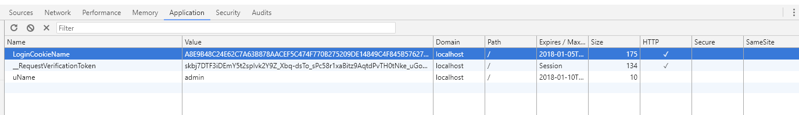

# Asp.Net MVC 身份验证-Forms

在MVC中对于需要登陆才可以访问的页面，只需要在对应的Controller或Action上添加特性`[Authorize]`就可以限制非登录用户访问该页面。那么如果实现登录？

## Form登录


#### 应用程序确认用户状态


HTTP协议是无状态的。所以上一次请求和下一次请求并不能相互关联起来，就是说这些请求并不能确定是哪个用户和用户的状态。但是对于登录来说，我们就需要准确的知道用户的状态及是哪个用户。

通常有两种情况来记录用户状态。

* 一种在服务端通过Session来标识。

* 一种通过Cookie在客户端标识用户。*（用户每次请求应用程序时都会携带该Cookie。）*


### Form登录实现

>Forms 身份验证将身份验证标记保留在 Cookie 或页的 URL 中。Forms 身份验证通过 FormsAuthenticationModule 类参与到 ASP.NET 页面的生命周期中。可以通过 FormsAuthentication 类访问 Forms 身份验证信息和功能。

#### 步骤一

在`Web.Config`配置文件中指定验证的方式为`Form`，并设置跳转的登录地址和Cookie的名称，及超时时间等。

```xml
<system.web>
    <authentication mode="Forms">
      <forms loginUrl="/Home/Login" timeout="120" cookieless="UseCookies" name="LoginCookieName"></forms>
    </authentication>  
  </system.web>
```

*设置该配置文件，并不需要特意给Action传递returnUrl，就可以获取到跳转地址。*

[Form特性的详细说明](https://msdn.microsoft.com/zh-cn/library/1d3t3c61(v=vs.110).aspx)


此时当未登录的用户访问有[Authorize]特性的Action操作时，会被跳转到Login页面，同时Login页面的URL后面会添加一个加密的ReturnUrl地址，该地址指向之前访问的有[Authorize]特性的Action地址。

---

#### 步骤二

之前提到Form认证其实就是生成了一个Cookie，存放到用户的浏览器中。通过`FormAuthenication.SetAuthCookie(userName,true);`设置验证登录的Cookie。再通过页面跳转将Cookie响应给客户端。

```CSharp
[HttpPost]
[ValidateAntiForgeryToken]
public ActionResult Login(LoginViewModel vm,string returnUrl)
{
    if (ModelState.IsValid)
    {
        //用户名，密码验证

        FormsAuthentication.SetAuthCookie(vm.UserName, true); //设置Form验证Cookie,后一个 参数为是否创建持久Cookie。及true为可以在用户浏览器上保存的。false为不在浏览器上保存。
        if (Url.IsLocalUrl(returnUrl))
        {
            return Redirect(returnUrl);
        }
        return RedirectToAction("Detail");
    }
    else
        return View(vm);
}
```

此时当我们登录以后会在浏览器中生成一个跟配置文件中名称相同的Cookie

如：



该Cookie就是我们已经登录，通过Form验证的凭证。

此时我们就可以访问那些需要登录才能访问的页面。

---

### 注销

删除对应的Cookie即可实现注销，代码如下：

```CSharp
[Authorize]
public ActionResult LogOut()
{
    FormsAuthentication.SignOut();//通过Forms验证来删除Cookie
    return View();
}

```
---

### 角色添加

有些页面可能只允许特定用户才能访问，在MVC中可以通过`[Authorize(Roles="VIP")]`设置Action或Controller，表示只有角色为VIP的用户才可以访问该页面。

如：只有登录且用户角色为VIP的才可以访问这个页面。

```CSharp
[Authorize(Roles = "VIP")]
public ActionResult VIP()
{
    return View();
}
```

**同时**

需要在设置Form验证凭据时把用户角色添加到Cookie。

如：

```CSharp
 [HttpPost]
[ValidateAntiForgeryToken]
public ActionResult Login(LoginViewModel vm, string returnUrl)
{
    if (ModelState.IsValid)
    {
       //用户名，密码验证

        //FormsAuthentication.SetAuthCookie(vm.UserName, true); //设置Form验证Cookie,后一个 参数为是否创建持久Cookie。及true为可以在用户浏览器上保存的。false为不在浏览器上保存。
        //if (Url.IsLocalUrl(returnUrl))
        //{
        //    return Redirect(returnUrl);
        //}
        //return RedirectToAction("Detail");


        vm.Role = "VIP";
        var authTicket = new FormsAuthenticationTicket(
                            1,                             // 版本
                            vm.UserName,                   // 用户名称
                            DateTime.Now,                  // 创建日期
                            DateTime.Now.AddMinutes(20),   // 过期时间
                            vm.Remember,                   // 是否记住
                            vm.Role                        // 用户角色
                            );

        string encryptedTicket = FormsAuthentication.Encrypt(authTicket);

        var authCookie = new HttpCookie(FormsAuthentication.FormsCookieName, encryptedTicket);
        authCookie.HttpOnly = true;//客户端脚本不能访问
        authCookie.Secure = FormsAuthentication.RequireSSL;//是否仅用https传递cookie
        authCookie.Domain = FormsAuthentication.CookieDomain;//与cookie关联的域
        authCookie.Path = FormsAuthentication.FormsCookiePath;//cookie关联的虚拟路径
        Response.Cookies.Add(authCookie);
        if (Url.IsLocalUrl(returnUrl))
        {
            return Redirect(returnUrl);
        }

        return RedirectToAction("Detail");
    }
    else
        return View(vm);
}
```

在Global.asax.cs文件中重写`Application_AuthenticateRequest`事件

```CSharp
protected void Application_AuthenticateRequest(Object sender, EventArgs e)
{
    //获取Cookie
    HttpCookie authCookie = Context.Request.Cookies[FormsAuthentication.FormsCookieName];
    if (authCookie == null || authCookie.Value == "")
        return;

    FormsAuthenticationTicket authTicket;
    try
    {
        //解析Cookie
        authTicket = FormsAuthentication.Decrypt(authCookie.Value);
    }
    catch
    {
        return;
    }

    // 解析权限
    string[] roles = authTicket.UserData.Split(';');

    if (Context.User != null)
        //把权限赋值给当前用户
        Context.User = new GenericPrincipal(Context.User.Identity, roles);
}
```

---

至此最简单的Form身份验证实现了。但是该Cookie只包含了用户名，没有其他信息。如果要包含其他信息，可以通过扩展用户的身份标识（HttpContext.User实例）来实现。

HttpContext.User定义如下


```CSharp
//获取或设置当前 HTTP 请求的安全信息。
public IPrincipal User
{
	get;
	[SecurityPermissionAttribute(SecurityAction.Demand, ControlPrincipal = true)]
	set;
}
```


通过User属性可以访问Iprincipal接口的属性和方法。


如：

```CSharp
public class MyFormsPrincipal<TUserData> : IPrincipal where TUserData : class, new()
{
    private IIdentity _identity;
    private TUserData _userData;

    public MyFormsPrincipal(FormsAuthenticationTicket ticket, TUserData userData)
    {
        if( ticket == null )
            throw new ArgumentNullException("ticket");
        if( userData == null )
            throw new ArgumentNullException("userData");

        _identity = new FormsIdentity(ticket);//Forms身份验证
        _userData = userData;
    }
    
    public TUserData UserData
    {
        get { return _userData; }
    }

    public IIdentity Identity
    {
        get { return _identity; }
    }

    public bool IsInRole(string role)
    {
        return false;
    }
}

```

> 这个方法的核心是：
> 1. 在登录时，创建自定义的FormsAuthenticationTicket对象，它包含了用户信息。
>2. 加密FormsAuthenticationTicket对象。
>3. 创建登录Cookie，它将包含FormsAuthenticationTicket对象加密后的结果。
>4. 在管线的早期阶段，读取登录Cookie，如果有，则解密。
>5. 从解密后的FormsAuthenticationTicket对象中还原我们保存的用户信息。
>6. 设置HttpContext.User为我们自定义的对象。

---


