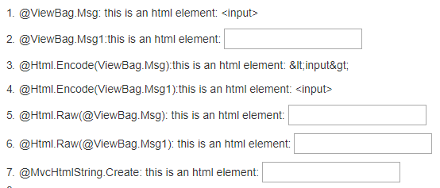

# Asp.Net MVC - Htmlhelper

HtmlHelper是一个返回Html字符串的方法。返回的字符串可以是任意类型。例如你可以使用HtmlHelper方法返回一个标准的html标签`<input>` `<button>` ``等等。

你也可以自定义HtmlHelper方法，返回一些复杂的html，来展示数据。

## Razor编码
首先需要认识了解一下Razor的编码

**在Razor中返回类型为`IHtmlString`的都会被编码成html，其他都是string字符串。**

```CSharp
 string msgStr = "this is an html element: <input>";
 ViewBag.Msg = msgStr;
 ViewBag.Msg1 = new MvcHtmlString(msgStr);
```
Razor:



* Html.Encode()返回类型为string。
* Html.Raw()返回类型为IHtmlString。
* MvcHtmlString.Create返回类型为继承自IHtmlString的MvcHtmlStrin。
* ViewBag是动态类型，Controller里ViewBag是什么类型，在Razor对应就是何种类型。
---

简单总结下HtmlHelper的几种扩展方法。

## 1. 视图中的Helper方法

在razor页面中使用@helper创建一个自定义的方法，该方法只能用在当前razor页面中。
``` CSharp
@helper ListingItems(string[] items)
    {
    <ol>
    @foreach (string item in items)
    {
    <li>@item</li>
    }
    </ol>
    }
    
    <h3>Programming Languages:</h3>
    
    @ListingItems(new string[] { "C", "C++", "C#" })
    
    <h3>Book List:</h3>
    
    @ListingItems(new string[] { "How to C", "how to C++", "how to C#" })
```
---
## 2. 见的HtmlHelper扩展方法

该类型的Helper可以生成多种Hmtl控件如：`text boxe` `checkbox`等待。

首先声明一个Model

``` CSharp
[DisplayName("学生")]
public class Student
{
    public int StudentId { get; set; }
    [Display(Name="姓名")]
    public string StudentName { get; set; }
    public int Age { get; set; }
    public bool isNewlyEnrolled { get; set; }
    public string Password { get; set; }
    [DisplayFormat(DataFormatString = "{0:yyyy年MM月dd日}")]
    [Display(Name ="生日")]
    public DateTime BirthDay{get;set;}
}

```

### 1.1 TextBox       

Razor: 
``` CSharp
@model Student
//传递一个null值
@Html.TextBox("StudentName", null, new { @class = "form-control" })  
//使用一个字符串，作为值
@Html.TextBox("StudentName", "this is value", new { @class = "form-control" } 
//Controller:ViewBag.StudentName="Janes";
//使用ViewBag获取数据
@Html.TextBox("StudentName", (string)ViewBag.StudentName, new { @class = "form-control" })  
//Controller: StudentName="Janes";
//使用Model获取数据
@Html.TextBox("StudentName", Model.StudentName, new { @class = "form-control" })  
```
Html:

```Html
<input class="form-control" id="StudentName"  name="StudentName"  type="text"  value="" />
<input class="form-control" id="StudentName"  name="StudentName"  type="text"  value="this is value" />
<input class="form-control" id="StudentName"  name="StudentName"  type="text"  value="Janes" />
<input class="form-control" id="StudentName"  name="StudentName"  type="text"  value="Janes" />
```

### 1.2 TextBoxFor

Razor:
```CSharp
@model Student
//Controller: StudentName="Janes";
@Html.TextBoxFor(m => m.StudentName, new { @class = "form-control" })  

```
Html:
```Html
<input class="form-control" id="StudentName"  name="StudentName"  type="text" value="Janes" />
```
TextBox和TextBoxFor的区别：

* @Html.TextBox是一个弱类型，@Html.TextBoxFor()是个强类型。

* @Html.TextBox参数是一个字符串，@Html.TextBoxFor参数是一个lambda表达式。

* @Html.TextBox如果属性拼写错误在编译的时候不会报错，只能在运行才会报错。

* @Html.TextBoxFor在编译的时候会提示错误。

---

### 2.1 TextArea       

TextArea()方法是一种若类型的方法，name参数是一个字符串。name参数可以是Model的属性名。它将指定的属性与textarea绑定在一起。因此，它会自动显示文本区域中的Model的属性值，反之亦然。

Razor:    
```CSharp
@Html.TextArea("Textarea1", "val", 5, 15, new { @class = "form-control" })
```
Html:
```Html
<textarea class="form-control" cols="15" id="Textarea1" name="Textarea1" rows="5">val</textarea>
```
### 2.2 TextAreaFor

TextAreaFor方法是一种强类型的扩展方法。它为使用lambda表达式指定的Model中的属性生成了一个多行的元素。TextAreaFor方法将指定的Model属性绑定到textarea元素。因此，它会自动显示文本区域中的Model属性值，反之亦然。

Razor:
```CSharp
@model Student

@Html.TextAreaFor(m => m.Description, new { @class = "form-control" })  
```
Html:
```Html
<textarea class="form-control" cols="20"  id="Description"  name="Description"  rows="2"></textarea>
```
---


### 3.1 Password       
Razor:
``` CSharp
@Html.Password("OnlinePassword")
```
Html:
```Html
<input id="OnlinePassword"  name="OnlinePassword"  type="password"  value="" />
```
### 3.2 PasswordFor

Razor:
```CSharp
@model Student
//Controller: Password="mypassword";
@Html.PasswordFor(m => m.Password)
```
Html:
```Html
<input id="Password" name="Password" type="password" value="mypassword" />
```
---
### 4.1 Hidden          
生成一个包含指定名称、值和html属性的输入隐藏字段元素。
Razor:
```CSharp
@model Student
//Controller:StudentId=1;
@Html.Hidden("StudentId")
``` 
Html:
```Html
<input id="StudentId" name="StudentId" type="hidden" value="1" />
```

### 4.2 HiddenFor
是一种强类型扩展方法。它为使用lambda表达式指定的Model属性生成一个隐藏的输入元素。Hiddenfor方法将一个指定的Model属性绑定到一个指定的对象属性。因此，它自动将Model属性的值设置为隐藏字段，反之亦然。

Razor:
```CSharp
@model Student
@Html.HiddenFor(m => m.StudentId)
```
Html:
```Html
<input data-val="true" id="StudentId" name="StudentId" type="hidden" value="1" />
```
---
### 5.1 CheckBox        
Razor:
```CSharp
@Html.CheckBox("isNewlyEnrolled", true)
```
Html:
```Html
<input checked="checked" id="isNewlyEnrolled"  name="isNewlyEnrolled" type="checkbox" value="true" />
```

### 5.2 CheckBoxFor
Razor:
```CSharp
@model Student

@Html.CheckBoxFor(m => m.isNewlyEnrolled)
```
Html:
```Html
<input data-val="true" 
        data-val-required="The isNewlyEnrolled field is required." 
        id="isNewlyEnrolled" 
        name="isNewlyEnrolled" 
        type="checkbox" 
        value="true" />

<input name="isNewlyEnrolled" type="hidden" value="false" />
```
---
### 6.1 RadioButton        
Razor:
```CSharp
Male:   @Html.RadioButton("Gender","Male")  
Female: @Html.RadioButton("Gender","Female")  
```
Html:
```Html
Male: <input checked="checked" 
        id="Gender" 
        name="Gender" 
        type="radio" 
        value="Male" />

Female: <input id="Gender" 
        name="Gender" 
        type="radio" 
        value="Female" />
```

### 6.2 RadioButtonFor
Razor:
```CSharp
@model Student

@Html.RadioButtonFor(m => m.Gender,"Male")
@Html.RadioButtonFor(m => m.Gender,"Female")
```
Html:
```Html
<input checked="checked" id="Gender" name="Gender" type="radio" value="Male" />

<input id="Gender" name="Gender" type="radio" value="Female" />
```
---
### 7.1 DropDownList        
Razor:
```CSharp
@model Student

@Html.DropDownList("StudentGender", 
                    new SelectList(Enum.GetValues(typeof(Gender))),
                    "Select Gender",
                    new { @class = "form-control" })
```
Html:
```Html

<select class="form-control" id="StudentGender" name="StudentGender">
    <option>Select Gender</option> 
    <option>Male</option> 
    <option>Female</option> 
</select>
```
### 7.2 DropDownListFor
Razor:
```CSharp
@Html.DropDownListFor(m => m.StudentGender, 
                    new SelectList(Enum.GetValues(typeof(Gender))), 
                    "Select Gender")

```
Html:
```Html
<select class="form-control" id="StudentGender" name="StudentGender">
    <option>Select Gender</option> 
    <option>Male</option> 
    <option>Female</option> 
</select>
```
---

### 8.1 ListBox         
Razor:
```csharp
@Html.ListBox(“ListBox1”, new MultiSelectList(new [] {"Cricket", "Chess"}))
```
html:
```Html
<select id="ListBox1" multiple="multiple" name="ListBox1"> <option>Cricket</option> <option>Chess</option> </select>
```

---
 ### 9.1 Display 
Razor:
```Csharp
@model Student

@Html.Display("StudentName")

```
Html:
```Html
Steve
```

### 9.2 DisplayFor
Raozr:
```CSharp
@model Student

@Html.DisplayFor(m => m.StudentName)
```
Html:
```Html
Steve
```
---
### 10.1 Label
Razor:
```CSharp
@Html.Label("StudentName")
@Html.Label("StudentName","Student-Name")
```
Html:
```Html
<label for="StudentName">Name</label>
<label for="StudentName">Student-Name</label>
```

### 10.2 LabelFor
Razor:
```CSharp
@model Student

@Html.LabelFor(m => m.StudentName)
```
Html:
```Html
<label for="StudentName">Name</label>
```
---
### 11.1 Editor
该扩展方法是一种基于数据类型生成html输入元素的方法。Editor()或EditorFor()扩展方法基于Model对象的属性的数据类型生成html标签。

|数据类型|Html标签|
|-----|----|
|string|``` <input type="text" >```|
|int|```<input type="number" > ```|
|decimal, float|``` 	<input type="text" >```|
|boolean|``` <input type="checkbox" >```|
|Enum|```<input type="text" > ```|
|DateTime|``` <input type="datetime" >```|

Razor:
```CSharp
StudentId:      @Html.Editor("StudentId")
Student Name:   @Html.Editor("StudentName")
Age:            @Html.Editor("Age")
Password:       @Html.Editor("Password")
isNewlyEnrolled: @Html.Editor("isNewlyEnrolled")
Gender:         @Html.Editor("Gender")
DoB:            @Html.Editor("DoB")
```

### 11.2EditorFof
Razor:
```CSharp
StudentId:      @Html.EditorFor(m => m.StudentId)
Student Name:   @Html.EditorFor(m => m.StudentName)
Age:            @Html.EditorFor(m => m.Age)
Password:       @Html.EditorFor(m => m.Password)
isNewlyEnrolled: @Html.EditorFor(m => m.isNewlyEnrolled)
Gender:         @Html.EditorFor(m => m.Gender)
DoB:            @Html.EditorFor(m => m.DoB)

```
Html:
```Html

```
---
### 12 Form
Razor:
```CSharp
  @using (Html.BeginForm("ActionName", "ControllerName", FormMethod.Post, new { @class = "form" }))
    {
        
    }
```
Html:
```Html
<form action="/ControllerName/ActionName" class="form" method="post">       
     
</form>
```
---


### 13.1 Html.Action() 执行一个Action，并返回html字符串。

### 13.2 Html.ActionLink() 生成一个超链接。

如:

`Html.ActionLink("link text", "someaction", "somecontroller", new { id = "123" }, null) `

返回：

`<a href="/somecontroller/someaction/123">link text</a>`

### 13.3 Url.Action() 返回一个Action的链接地址 

如：

`Url.Action("someaction", "somecontroller", new { id = "123" })`

 返回：
 
 `/somecontroller/someaction/123`

---

## 自定义Helper扩展方法
您还可以通过在HtmlHelper类上创建扩展方法或在类中创建静态方法来创建自定义Helper方法。

```CSharp
    public static class CustomHelpers
    {
     //Submit Button Helper
     public static MvcHtmlString SubmitButton(this HtmlHelper helper, string 
     buttonText)
     {
     string str = "<input type=\"submit\" value=\"" + buttonText + "\" />";
     return new MvcHtmlString(str);
     }
     //Readonly Strongly-Typed TextBox Helper
     public static MvcHtmlString TextBoxFor<TModel, TValue>(this 
     HtmlHelper<TModel> htmlHelper, Expression<Func<TModel, TValue>>
     expression, bool isReadonly)
     {
     MvcHtmlString html = default(MvcHtmlString);
     
     if (isReadonly)
     {
     html = System.Web.Mvc.Html.InputExtensions.TextBoxFor(htmlHelper,
     expression, new { @class = "readOnly",
     @readonly = "read-only" });
     }
     else
     {
     html = System.Web.Mvc.Html.InputExtensions.TextBoxFor(htmlHelper,
     expression);
     }
     return html;
     }
    }
```
---
以上就是HtmlHelper的一些常用扩展方法。


