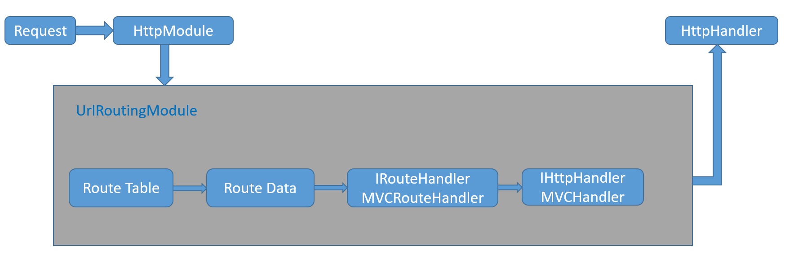
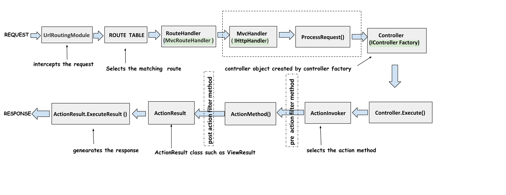

# Asp.Net MVC 路由

当用户通过URL访问网站时，要把用户请求的URL映射到正确的应用程序的操作上。那么如何实现这个映射--Routing（路由）。

路由并不专属于`Asp.Net MVC`,而是建立在`Asp.Net Framework`之上的一个组件，所以所有依赖`Asp.Net Framework`的都可以使用路由。如WebForms,API等,但是Asp.Net MVC 和路由密切相关。

图：路由关系图


---

## 路由工作流程

>Asp.Net是一个管道模型，一个Http请求先经过`HttpModule`，再通过`HttpHandlerFactory`，创建一个对应的`HttpHandler`处理对应的请求。所以对Asp.Net的所有的扩展也是通过注册这些管道事件来实现的。因为路由是建立在`Asp.Net Framework`之上的，所以路由也是注册实现了管道事件。但是是通过注册`HttpModule`的`PostResolveRequestCache`事件来实现的。


#### 为什么不注册HttpHandler来实现呢？

因为：

> 如果把请求的管道模型比作一个运行的火车的话，`HttpHandler`是请求火车的目的地。`HttpModule`是一个沿途的站点，要在终点前分析好这个请求是到哪个目的地。
> * `HttpHandler`多用来处理响应处理。
> * `HttpModule`多用来处理通用性和响应内容无关的功能。


小结：

**路由就是一个实现了`IHttpModule`接口的`UrlRoutingModule`的`HttpModule`,在管道事件中拦截请求，分析Url，匹配路由，再交给`HttpHandler`处理的过程。**

---

### 路由如何拦截请求 

上述认识到路由是通过实现了接口`IHttpModule`的类--`UrlRoutingModule`来注册管道事件，在该类中实现了请求拦截，路由匹配，创建指定HttpHandler。

所以路由组件中`UrlRoutingModule`就是是关键。

[UrlRoutingModule源码在线查看](http://referencesource.microsoft.com/#System.Web/Routing/UrlRoutingModule.cs,9b4115ad16e4f4a1)

通过该类的源代码可以发现。`UrlRoutingModule`注册了`PostResolveRequestCache`事件。注册该事件，纯粹是因为要在`HttpHandler`目的地创建之前执行路由。因为在管道事件中`PostMapRequestHandler`事件是把请求交给`HttpHandler`来处理。而`PostResolveRequestCache`在该事件之前。([Asp.Net管道事件](https://msdn.microsoft.com/en-us/library/ms178473.aspx))

```CSharp
    //UrlRoutingModule源码
 ...
 //注册事件PostResolveRequestCache 
 application.PostResolveRequestCache += OnApplicationPostResolveRequestCache;
 ...

```

查看`UrlRoutingModule`代码，发现该类的一个`PostResolveRequestCache`方法，实现了路由的工作。

```CSharp
    // UrlRoutingModule的本地方法
   public virtual void PostResolveRequestCache(HttpContextBase context) {
            // 根据HttpContext的Url匹配路由对象，该对象包含了Controller，Action和参数
            // Match the incoming URL against the route table
            RouteData routeData = RouteCollection.GetRouteData(context);
 
            // Do nothing if no route found
            if (routeData == null) {
                return;
            }

            //由匹配的路由对象创建一个MVCRouteHandler
            // If a route was found, get an IHttpHandler from the route's RouteHandler
            IRouteHandler routeHandler = routeData.RouteHandler;
            if (routeHandler == null) {
                throw new InvalidOperationException(
                    String.Format(
                        CultureInfo.CurrentCulture,
                        SR.GetString(SR.UrlRoutingModule_NoRouteHandler)));
            }
 
            // This is a special IRouteHandler that tells the routing module to stop processing
            // routes and to let the fallback handler handle the request.
            if (routeHandler is StopRoutingHandler) {
                return;
            }
 
            //封装匹配的路由对象和HttpContext，创建新的RequestContext
            RequestContext requestContext = new RequestContext(context, routeData);
 
            // Dev10 766875	Adding RouteData to HttpContext
            context.Request.RequestContext = requestContext;
            
            //获取MVCHandler
            IHttpHandler httpHandler = routeHandler.GetHttpHandler(requestContext);
            if (httpHandler == null) {
                throw new InvalidOperationException(
                    String.Format(
                        CultureInfo.CurrentUICulture,
                        SR.GetString(SR.UrlRoutingModule_NoHttpHandler),
                        routeHandler.GetType()));
            }
 
            if (httpHandler is UrlAuthFailureHandler) {
                if (FormsAuthenticationModule.FormsAuthRequired) {
                    UrlAuthorizationModule.ReportUrlAuthorizationFailure(HttpContext.Current, this);
                    return;
                }
                else {
                    throw new HttpException(401, SR.GetString(SR.Assess_Denied_Description3));
                }
            }
 
            // Remap IIS7 to our handler
            context.RemapHandler(httpHandler);
        }

```

即：

1. 根据`HttpContext`，路由匹配规则，匹配一个`RouteData`对象。
2. 调用`RouteData`对象的`RouteHandler`获取`IRouteHandler`的`MVCRouteHandler`。
3. 由匹配的`RouteData`和`HttpContext`创建`RequestContext`
4. 由2的`MVCRouteHandler`和3的`RequestContext`创建`IHttpHandler`-`MVCHandler`.
5. `HttpHandler`管道事件执行。

流程如下图所示：



之后`HttpHandler`的运行可以参考如下整个生命周期：

Asp.Net MVC 生命周期图：



---

## 路由的使用

`Global.asax`的`MVCApplication`是管理Asp.Net应用程序生命周期的管道事件的类。在类中实现管道事件或方法会在对应的管道事件中调用。

---

#### 配置路由

在`App_Start`文件下，新建`RouteConfig.cs`文件里配置路由信息。通过静态方法`RouteCollection.MapRoute()`配置路由信息。

如：

```CSharp
public class RouteConfig
{
    public static void RegisterRoutes(RouteCollection routes)
    {
        routes.IgnoreRoute("{resource}.axd/{*pathInfo}");//忽略该模式的URL

        routes.MapRoute(
            name: "Default",//路由名称
            url: "{controller}/{action}/{id}",//路由模板
            defaults: new { controller = "Home", action = "Index", id = UrlParameter.Optional }//路由默认值，参数id可以为空
        );
    }
}
```


* name:为该路由名称

* url：为路由模板，`{}`是占位符。

* defaults:为路由默认值


#### 注册路由

`Global.asax`的`MVCApplication`继承`HttpApplication`。而`HttpApplication`则是管理整个管道周期的实例。在该类中通过注册事件，或方法可以在管道事件中被调用。注册路由到应用程序就是在`Application_Start()`方法中实现。

如：

```CSharp
public class MvcApplication : System.Web.HttpApplication
{
    protected void Application_Start()
    {
        AreaRegistration.RegisterAllAreas();
        FilterConfig.RegisterGlobalFilters(GlobalFilters.Filters);
        RouteConfig.RegisterRoutes(RouteTable.Routes);//路由注册到应用程序
        BundleConfig.RegisterBundles(BundleTable.Bundles);
    }
}

```

---


#### URL匹配

在配置路由里创建了一个路由名为`Default`的路由。该`Default`路由由`controller`，`action`，`id`三部分组成，其中`id`为可选参数。

该路由可以匹配如下url：

* xxx.com/home/index/1
* xxx.com/home/index
* xxx.com/home
* xxx.com/

这些URL都会映射到如下Action：

```CSharp
public class HomeController :Controller
{
    public ActionResult Index()
    {
        return View();
    }
}
```

或

```CSharp
//在路由中id参数是可为空的，所以对于值类型的参数必须是可空的值类型。
public class HomeController :Controller
{
    public ActionResult Index(int? id)
    {
        return View();
    }
}
```

并且该`Action`的参数名称需要和`Route`中的参数（id）一致。即也是id。才可以匹配`xxx.com/home/index/1`否则只能通过url传参匹配`xxx.com/home/index?myparam=1`

如：如果定义的Action如下

```CSharp
public class HomeController :Controller
{
    public ActionResult Index(string str)
    {
        return View();
    }
}
```

输入`xxx.com/home/index/1`时，会认为参数为空，即`str`并没有被赋值，但是依然会调用`index`方法，只不过是认为`str`为空。但是当你通过url传参请求时`xxx.com/home/index?str=hello`，是可以匹配到这个`Action`，也可以给`str`赋值。

---

**在同一个Controller下是不允许有Action重载的**

如：

```CSharp
public class HomeController :Controller
{
    public ActionResult Index(int? id)
    {
        return View();
    }
    public ActionResult Index()
    {
        return View();
    }
}
```

`在请求时提示错误：在对控制器类型“HomeController”的操作Index的请求方法不明确。`

---

#### 路由顺序和优先级

路由引擎在定位路由时，会遍历路由集合中的所有路由。只要发现了一个匹配的路由，会立即停止搜索。所以定义路由一定要注意路由的先后循序。一般是越是精确的放在前面。

如：有一个如下的路由配置

```CSharp
routes.MapRoute{
    name:  "one",
    url:"{site}",
    defaults:new{controller="MyControllerOne",action="Index"}
}
routes.MapRoute{
    name:"two",
    url:"Admin",
    defaults:new {controller="Admin",action="Index"}
}
```
第一个路由有一个{site}占位符。默认的控制器为`MyControllerOne`。第二个路由是一个常量`Admin,`默认的控制器为`Admin`。这两个都是正确的路由配置。但是当我们输入url`xxx.com/admin`时，我们预想的是请求`AdminController`下的`Index`操作方法。但是根据上面的路由映射，该url会匹配第一个路由，然后就停止了路由查找。此时触发的`Controller`为`MyControllerOne`。

---

#### 路由约束

之前的路由配置，都没有url的参数的类型信息。如果我们的Action是一个Int类型，但是url中的参数是个字符串，这样就会导致错误。所以如果有url的类型约束可以规避这个错误的发生。

在Asp.Net MVC中我们可以通过正则表达式来约束路由。

如：

```CSharp
routes.MapRoute{
    "Default",
    "{controller}/{action}/{id}",
    new{controller="Home",action="Index",id=UrlParameter.Optional},
    new{id="\d+"}//该id为整数
}
```

除了使用正则表达式来约束路由，我们还可以通过继承IRouteConstraint接口自定义约束规则

如：

```CSharp
public class MyRouteConstraint : IRouteConstraint
{
    public bool Match(HttpContextBase httpContext, Route route, string parameterName, RouteValueDictionary values, RouteDirection routeDirection)
    {
        //获取id的值
        var id = values[parameterName];

        //id验证方法

        return true;
    }
}
```

更新路由配置

```CSharp
routes.MapRoute{
    "Default",
    "{controller}/{action}/{id}",
    new{controller="Home",action="Index",id=UrlParameter.Optional},
    new{id=new MyRouteConstraint()}
}
```

That's it

---


如有不对，请多多指教。

---
