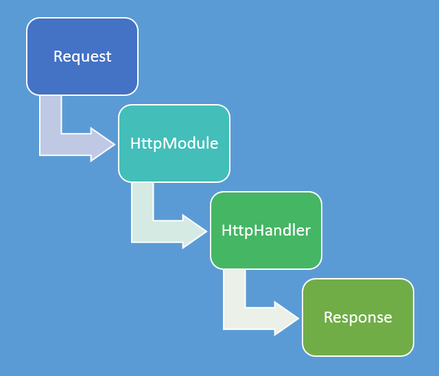

# Asp.Net MVC 路由

当用户通过URL访问网站时，要把用户请求的URL映射到正确的应用程序的操作上。那么如何实现这个映射--Routing（路由）。

路由并不专属于`Asp.Net MVC`,而是建立在Asp.Net之上的一个组件，所以所有依赖Asp.Net的都可以使用路由。如WebForms,API等。


图：路由关系图


Asp.Net是一个管道模型，一个Http请求先经过HttpModule，再通过HttpHandlerFactory，创建一个对应的HttpHandler处理对应的请求。

> 如果把请求的管道模型比作一个运行的火车的话，HttpHandler是请求火车的目的地。HttpModule是一个沿途的站点。

* `HttpHandler`多用来处理响应处理。
* `HttpModule`多用来处理通用性和响应内容无关的功能。



>在管道模型中，路由实现了接口`IHttpModule`的类`UrlRoutingModule`来对所有请求进行拦截，并通过对请求的分析为动态的匹配一个用于处理该请求的HttpHandler。HttpHandler对请求进线响应操作。


>使用URL请求应用程序时，该请求最终是通过Handler来完成，Asp.Net MVC 是通过一个自定义的`HttpHandler`--`MVCHandler`来实现对Controller的激活和Action执行。但是在这之前对Controller和Action的解析是通过Asp.Net的URL路由系统来完成，整个路由系统是通过一个自定义的`HttpModule`--`UrlRoutingModule`来是实现的。

**即： 路由是对URL到Controller和Action的映射及URL的输出。**

---

## 路由注册与配置

`Global.asax`包含了Asp.Net应用程序生命周期的handler事件。实现`HttpApplication`的方法或事件，会在对应的生命周期中调用。在`Global.asax`文件中`MVCApplication`类中实现`Application_Start()`方法会在应用程序启动时执行，且只执行一次。所以在该方法中注册路由。

---

#### 配置路由

在`App_Start`文件下，新建`RouteConfig.cs`文件里配置路由信息。通过静态方法`RouteCollection.MapRoute()`配置路由信息。

如：

```CSharp
public class RouteConfig
{
    public static void RegisterRoutes(RouteCollection routes)
    {
        routes.IgnoreRoute("{resource}.axd/{*pathInfo}");//忽略该模式的URL

        routes.MapRoute(
            name: "Default",//路由名称
            url: "{controller}/{action}/{id}",//路由模板
            defaults: new { controller = "Home", action = "Index", id = UrlParameter.Optional }//路由默认值，参数id可以为空
        );
    }
}
```


* name:为该路由名称

* url：为路由模板，`{}`是占位符。

* defaults:为路由默认值


#### 注册路由

当MVC应用程序第一次启动时，会调用`Global.asax`文件中`MVCApplication`类的`Application_Start()`方法。调用`RouteConfig`类的静态方法`RegisterRoutes(RouteTable.Routes)`将RouteTable注册到应用程序。

```CSharp
public class MvcApplication : System.Web.HttpApplication
{
    protected void Application_Start()
    {
        AreaRegistration.RegisterAllAreas();
        FilterConfig.RegisterGlobalFilters(GlobalFilters.Filters);
        RouteConfig.RegisterRoutes(RouteTable.Routes);//路由注册到应用程序
        BundleConfig.RegisterBundles(BundleTable.Bundles);
    }
}

```

---


#### URL匹配

在配置路由里创建了一个路由名为`Default`的路由。该`Default`路由由`controller`，`action`，`id`三部分组成，其中`id`为可选参数。

该路由可以匹配如下url：

* xxx.com/home/index/1
* xxx.com/home/index
* xxx.com/home
* xxx.com/

这些URL都会映射到如下Action：

```CSharp
public class HomeController :Controller
{
    public ActionResult Index()
    {
        return View();
    }
}
```

或

```CSharp
//在路由中id参数是可为空的，所以对于值类型的参数必须是可空的值类型。
public class HomeController :Controller
{
    public ActionResult Index(int? id)
    {
        return View();
    }
}
```

并且该`Action`的参数名称需要和`Route`中的参数（id）一致。即也是id。才可以匹配`xxx.com/home/index/1`否则只能通过url传参匹配`xxx.com/home/index?myparam=1`

如：如果定义的Action如下

```CSharp
public class HomeController :Controller
{
    public ActionResult Index(string str)
    {
        return View();
    }
}
```

输入`xxx.com/home/index/1`时，会认为参数为空，即`str`并没有被赋值，但是依然会调用`index`方法，只不过是认为`str`为空。但是当你通过url传参请求时`xxx.com/home/index?str=hello`，是可以匹配到这个`Action`，也可以给`str`赋值。

---

**在同一个Controller下是不允许有Action重载的**

如：
```CSharp
public class HomeController :Controller
{
    public ActionResult Index(int? id)
    {
        return View();
    }
    public ActionResult Index()
    {
        return View();
    }
}
```

`在请求时提示错误：在对控制器类型“HomeController”的操作Index的请求方法不明确。`

---

## 路由顺序和优先级

路由引擎在定位路由时，会遍历路由集合中的所有路由。只要发现了一个匹配的路由，会立即停止搜索。所以定义路由一定要注意路由的先后循序。一般是越是精确的放在前面。

如：有一个如下的路由配置
```CSharp
routes.MapRoute{
    name:  "one",
    url:"{site}",
    defaults:new{controller="MyControllerOne",action="Index"}
}
routes.MapRoute{
    name:"two",
    url:"Admin",
    defaults:new {controller="Admin",action="Index"}
}
```
第一个路由有一个{site}占位符。默认的控制器为`MyControllerOne`。第二个路由是一个常量`Admin,`默认的控制器为`Admin`。这两个都是正确的路由配置。但是当我们输入url`xxx.com/admin`时，我们预想的是请求`AdminController`下的`Index`操作方法。但是根据上面的路由映射，该url会匹配第一个路由，然后就停止了路由查找。此时触发的`Controller`为`MyControllerOne`。

---

## 路由约束

之前的路由配置，都没有url的参数的类型信息。如果我们的Action是一个Int类型，但是url中的参数是个字符串，这样就会导致错误。所以如果有url的类型约束可以规避这个错误的发生。

在Asp.Net MVC中我们可以通过正则表达式来约束路由。

如：

```CSharp
routes.MapRoute{
    "Default",
    "{controller}/{action}/{id}",
    new{controller="Home",action="Index",id=UrlParameter.Optional},
    new{id="\d+"}//该id为整数
}
```

除了使用正则表达式来约束路由，我们还可以通过继承IRouteConstraint接口自定义约束规则

如：
```CSharp
public class MyRouteConstraint : IRouteConstraint
{
    public bool Match(HttpContextBase httpContext, Route route, string parameterName, RouteValueDictionary values, RouteDirection routeDirection)
    {
        //获取id的值
        var id = values[parameterName];

        //id验证方法

        return true;
    }
}
```

更新路由配置

```CSharp
routes.MapRoute{
    "Default",
    "{controller}/{action}/{id}",
    new{controller="Home",action="Index",id=UrlParameter.Optional},
    new{id=new MyRouteConstraint()}
}
```

That's it

---


如有不对，请多多指教。

---
