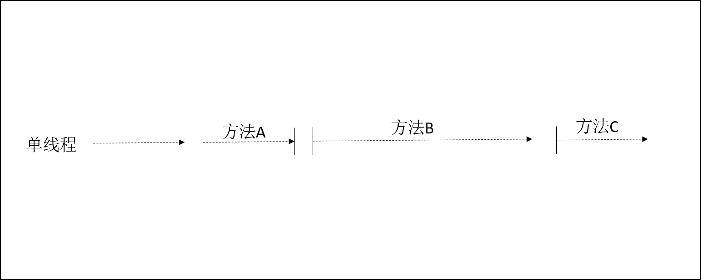
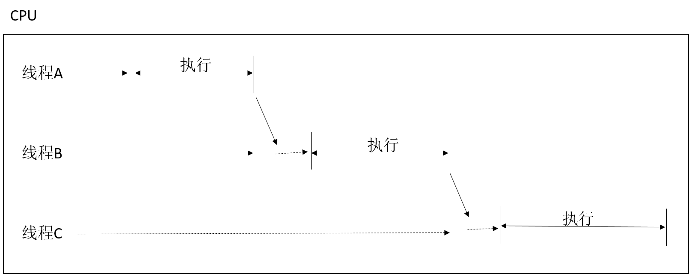
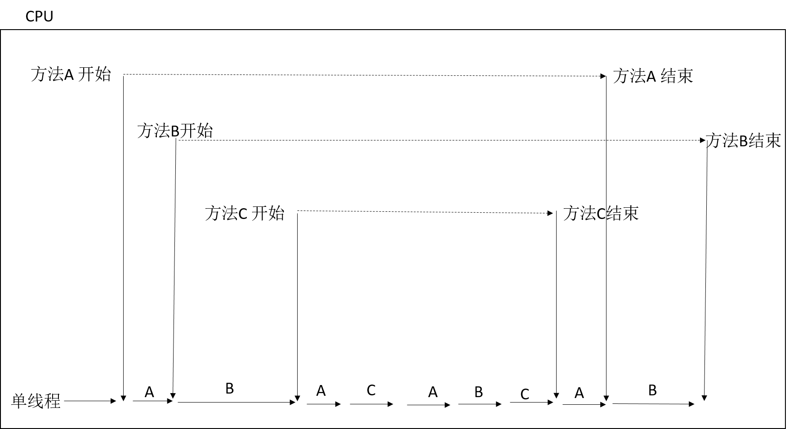
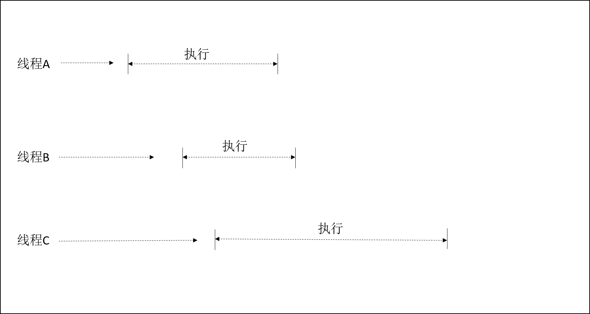

# C#之异步

在计算机中，一个线程就是一系列的命令，一个工作单元。操作系统可以管理多个线程，给每个线程分配cpu执行的时间片，然后切换不同的线程在这个cpu上执行。这种单核的处理器一次只能做一件事，不能同时做两件以上的事情，只是通过时间的分配来实现多个线程的执行。但是在多核处理器上，可以实现同时执行多个线程。操作系统可以将时间分配给第一个处理器上的线程，然后在另一个处理器上分配时间给另一个线程。

**异步是相对于同步而言。跟多线程不能同一而论。**

异步编程采用future或callback机制，以避免产生不必要的线程。（*一个future代表一个将要完成的工作。*）异步编程核心就是：启动了的操作将在一段时间后完成。这个操作正在执行时，不会阻塞原来的线程。启动了这个操作的线程，可以继续执行其他任务。当操作完成时，会通知它的future或者回调函数，以便让程序知道操作已经结束。

为什么要使用异步：

面向终端用户的GUI程序：异步编程提高了相应能力。可以使程序在执行任务时仍能相应用户的输入。
服务器端应用：实现了可扩展性。服务器应用可以利用线程池满足其可扩展性。
----

### 异步和同步的区别：
如果以同步方式执行某个任务时，需要等待该任务完成，然后才能再继续执行另一个任务。而用异步执行某个任务时，可以在该任务完成之前执行另一个任务。**异步最重要的体现就是不排队，不阻塞**。

图：单线程同步


图：多线程同步


----

### 异步跟多线程

异步可以在单个线程上实现，也可以在多个线程上实现，还可以不需要线程（一些IO操作）。

图：单线程异步


图：多线程异步


---

### 异步是否创建线程

异步可以分为CPU异步和IO异步。异步在CPU操作中是必须要跑在线程上的，一般情况下这时我们都会新开一个线程执行这个异步操作。但在IO操作中是不需要线程的，硬件直接和内存操作。
但是是否创建线程取决于你的异步的实现方式。比如在异步你用ThreadPool,Task.Run()等方法是创建了一个线程池的线程，那么该异步是在另一个线程上执行。

----

**C#实现异步的四种方式：**

1. 异步模式BeginXXX,EndXXX
2. 事件异步xxxAsync，xxxCompleted
3. 基于任务`Task`的异步
4. `async`,`await`关键字异步

----
## 异步模式

异步模式是调用`Beginxxx`方法，返回一个`IAsyncResult`类型的值，在回调函数里调用`Endxxxx（IAsyncResult）`获取结果值。

异步模式中最常见的是委托的异步。

如：声明一个string类型输入参数和string类型返回值的委托。调用委托的BeginInvoke方法，来异步执行该委托。
```CSharp
 Func<string, string> func = (string str) =>
             {
                 Console.WriteLine(str);
                 return str + " end";
             };
            func.BeginInvoke("hello",IAsyncResult ar =>
            {
                Console.WriteLine(func.EndInvoke(ar));
            }, null);
//输出：
//hello
//hello end
```
`BeginInvoke`方法的第一个参数表示委托的输入参数。

第二个参数表示`IAsyncResult`类型输入参数的回调函数，其实也是个委托。

第三个参数是个状态值。


---

## 事件异步

事件异步有一个`xxxAsync`方法，和对应该方法的 `xxxCompleted`事件。

如： `backgroundworker`和`progressbar`结合

```CSharp

    public partial class MainWindow : Window
    {
        private BackgroundWorker bworker = new BackgroundWorker();
        public MainWindow()
        {
            InitializeComponent();
            //支持报告进度
            bworker.WorkerReportsProgress = true;
            //执行具体的方法
            bworker.DoWork += Bworker_DoWork;
            //进度变化时触发的事件
            bworker.ProgressChanged += Bworker_ProgressChanged;
            //异步结束时触发的事件
            bworker.RunWorkerCompleted += Bworker_RunWorkerCompleted;
            Loaded += MainWindow_Loaded;
        }

        private void MainWindow_Loaded(object sender, RoutedEventArgs e)
        {
            //开始异步执行
            bworker.RunWorkerAsync();
        }

        private void Bworker_RunWorkerCompleted(object sender, RunWorkerCompletedEventArgs e)
        {
            //异步完成时触发的事件
            progressBar.value=100;
        }

        private void Bworker_ProgressChanged(object sender, ProgressChangedEventArgs e)
        {
            //获取进度值复制给progressBar
            progressBar.Value = e.ProgressPercentage;
        }

        private void Bworker_DoWork(object sender, DoWorkEventArgs e)
        {
            for (int j = 0; j <= 100; j++)
            {
                //调用进度变化方法，触发进度变化事件
                bworker.ReportProgress(j);
                Thread.Sleep(100);
            }
        }
    }

```
---

## Task模式的异步
`Task`是在Framework4.0提出来的新概念。`Task`本身就表示一个异步操作（*`Task`默认是运行在线程池里的线程上*）。它比线程更轻量，可以更高效的利用线程。并且任务提供了更多的控制操作。

* 实现了控制任务执行顺序
* 实现父子任务
* 实现了任务的取消操作
* 实现了进度报告
* 实现了返回值
* 实现了随时查看任务状态

任务的执行默认是由任务调度器来实现的(*任务调用器使这些任务并行执行*)。任务的执行和线程不是一一对应的。有可能会是几个任务在同一个线程上运行，充分利用了线程，避免一些短时间的操作单独跑在一个线程里。所以任务更适合CPU密集型操作。

#### Task 启动

任务可以赋值立即运行，也可以先由构造函数赋值，之后再调用。
```CSharp
//启用线程池中的线程异步执行
 Task t1 = Task.Factory.StartNew(() =>
            {
                Console.WriteLine("Task启动...");
            });
//启用线程池中的线程异步执行
 Task t2 = Task.Run(() =>
            {
                Console.WriteLine("Task启动...");
            });

 Task t3 = new Task(() =>
            {
                Console.WriteLine("Task启动...");
            });
 t3.Start();//启用线程池中的线程异步执行
 t3.RunSynchronously();//任务同步执行
```

#### Task 等待任务结果，处理结果
```CSharp
 Task t1 = Task.Run(() =>
            {
                Console.WriteLine("Task启动...");
            });
 Task t2 = Task.Run(() =>
            {
                Console.WriteLine("Task启动...");
            });

 //调用WaitAll() ，会阻塞调用线程，等待任务执行完成 ,这时异步也没有意义了          
 Task.WaitAll(new Task[] { t1, t2 });
 Console.WriteLine("Task完成...");

 //调用ContinueWith，等待任务完成，触发下一个任务，这个任务可当作任务完成时触发的回调函数。
 //为了获取结果，同时不阻塞调用线程，建议使用ContinueWith，在任务完成后，接着执行一个处理结果的任务。
t1.ContinueWith((t) =>
{
    Console.WriteLine("Task完成...");
});
t2.ContinueWith((t) =>
{
    Console.WriteLine("Task完成...");
});

//调用GetAwaiter()方法，获取任务的等待者，调用OnCompleted事件，当任务完成时触发
//调用OnCompleted事件也不会阻塞线程
t1.GetAwaiter().OnCompleted(() =>
{
    Console.WriteLine("Task完成...");
});
t2.GetAwaiter().OnCompleted(() =>
{
    Console.WriteLine("Task完成...");
});

```

#### Task 任务取消
```CSharp
//实例化一个取消实例
var source = new CancellationTokenSource();
var token = source.Token;

Task t1 = Task.Run(() =>
{
    Thread.Sleep(2000);
    //判断是否任务取消
    if (token.IsCancellationRequested)
    {
        //token.ThrowIfCancellationRequested();
        Console.WriteLine("任务已取消");
    }
    Thread.Sleep(500);
    //token传递给任务
}, token);

Thread.Sleep(1000);
Console.WriteLine(t1.Status);
//取消该任务
source.Cancel();
Console.WriteLine(t1.Status);
            
```
#### Task 返回值
```CSharp
Task<string> t1 = Task.Run(() => TaskMethod("hello"));
t1.Wait();
Console.WriteLine(t1.Result);

public string TaskMethod(string str)
{
    return str + " from task method";
}

```
**Task异步操作，需要注意的一点就是调用Waitxxx方法，会阻塞调用线程。**

----
## async await 异步

首先要明确一点的就是`async` `await` 不会创建线程。并且他们是一对关键字，必须成对的出现。

如果`await`的表达式没有创建新的线程，那么一个异步操作就是在调用线程的时间片上执行，否则就是在另一个线程上执行。

```CSharp
async Task MethodAsync()
{
    Console.WriteLine("异步执行");//同步程序块1
    await Task.Delay(4000); 
    Console.WriteLine("异步执行结束");//同步程序块2
}
```
一个异步方法必须有`async`修饰，且方法名以Async结尾。异步方法体至少包含一个`await`表达式。`await` 可以看作是一个挂起异步方法的一个点，且同时把控制权返回给调用者。异步方法的返回值必须是`Task`或者`Task<T>`。即如果方法没有返回值那就用Task表示，如果有一个string类型的返回值，就用Task泛型`Task<string>`修饰。

异步方法执行流程：

1. 主线程调用MethodAsync方法，并等待方法执行结束
2. 异步方法开始执行，输出“异步执行”
3. 异步方法执行到await关键字，此时MethodAsync方法挂起，等待await表达式执行完毕，同时将控制权返回给调用方主线程，主线程继续执行。
4. 执行Task.Delay方法，同时主线程继续执行之后的方法。
5. `Task.Delay`结束，`await`表达式结束，MehtodAsync执行await表达式之后的语句，输出“异步执行结束”。


和其他方法一样，async方法开始时以同步方式执行。在async内部，await关键字对它的参数执行一个异步等待。它首先检查操作是否已经完成，如果完成了，就继续运行（同步方式）。否则它会暂停async方法，并返回，留下一个未完成的Task。一段时间后，操作完成，async方法就恢复运行。

一个async方法是由多个同步执行的程序块组成的，每个同步程序块之间由await语句分隔。第一个同步程序块是在调用这个方法的线程中执行，但其他同步程序块在哪里运行呢？情况比较复杂。

最常见的情况是用await语句等待一个任务完成，当该方法在await处暂停时，就可以捕获上下文（context）。如果当前SynchronizationContext不为空，这个上下文就是当前SynchronizationContext。如果为空，则这个上下文为当前TaskScheduler。该方法会在这个上下文中继续运行。一般来说，运行在UI线程时采用UI上下文，处理Asp.Net请求时采用Asp.Net请求上下文，其他很多情况下则采用线程池上下文。

因为，在上面的代码中，每个同步程序块会试图在原始的上下文中恢复运行。如果在UI线程调用async方法，该方法的每个同步程序块都将在此UI线程上运行。但是，如果在线程池中调用，每个同步程序块将在线程池上运行。

如果要避免这种行为，可以在await中使用configureAwait方法，将参数ContinueONCapturedContext设置为false。async方法中await之前的代码会在调用的线程里运行。在被await暂停后，await之后的代码则会在线程池里继续运行。

```CSharp
async Task MethodAsync()
{
    Console.WriteLine("异步执行");//同步程序块1
    await Task.Delay(4000).ConfigureAwait(false); 
    Console.WriteLine("异步执行结束");//同步程序块2
}
```

我们可能想当然的认为`Task.Delay`会阻塞执行线程，就跟`Thread.Sleep`一样。其实他们是不一样的。`Task.Delay`创建一个将在设置时间后执行的任务。就相当于一个定时器，多少时间后再执行操作。不会阻塞执行线程。

当我们在异步线程中调用Sleep的时候，只会阻塞异步线程。不会阻塞到主线程。

```CSharp
async Task Method2Async()
{
    Console.WriteLine("await执行前..."+Thread.CurrentThread.ManagedThreadId);
    await Task.Run(() =>
    {
        Console.WriteLine("await执行..." + Thread.CurrentThread.ManagedThreadId);
        Thread.Sleep(5000);
        Console.WriteLine("await执行结束..." + Thread.CurrentThread.ManagedThreadId);
        
    });
    Console.WriteLine("await之后执行..."+ Thread.CurrentThread.ManagedThreadId);
}

//输出：
//await执行前...9
//await执行...12
//await之后执行...9
//await执行结束...12
```
上面的异步方法，`Task`创建了一个线程池线程，Thread.Sleep执行在线程池线程中。

---
参考：
* [Async](https://docs.microsoft.com/en-us/dotnet/standard/async-in-depth)

* [Task](https://docs.microsoft.com/en-us/dotnet/standard/parallel-programming/task-based-asynchronous-programming)
* [StackOverflow](https://stackoverflow.com/questions/748175/asynchronous-vs-synchronous-execution-what-does-it-really-mean)