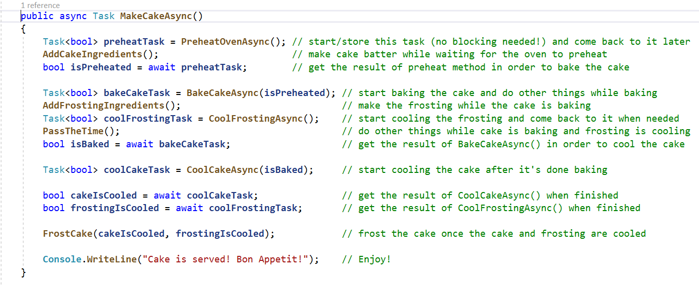

# 我如何考虑异步代码？！

异步代码对于编写响应式应用程序越来越重要，正变得越来越流行。遗憾的是，异步编程增加了代码的复杂性。因此，无论您的编程水平如何，了解异步的工作原理都很有一定难度。无论您是菜鸟还是只想复习一下，本文将介绍异步代码！

### 什么是异步代码？

异步（`async`）**编程允许您可以不停止（或不阻止）执行该操作的整个线程的同时执行一个代码块**。异步代码的一个常见错误认识是，它提高了性能，这不一定是真的。相反，**异步编程的主要功能是，它在不阻止调用这些异步操作的线程的同时增加了可以同时执行的任务（吞吐量）的数量**。（*异步不一定使得这块代码执行的速度更快，但是可以增加更多的调用者*）

您可能认为异步代码似乎有点像多线程代码。毕竟，许多方法可以同时在两者中执行。实际上，异步编程可以与单数或多线程应用程序一起使用。就是说可以有一个单线程异步程序，其中一个线程可以运行并发任务。相反，还可以有一个多线程异步应用程序，其中多个线程可以每个线程运行多个并发任务。（*一个线程可以并发执行多个异步任务(该类型的任务通常都是IO操作，不大量消耗CPU)*）

### 为什么要使用异步代码？举个栗子！

我们用一个包含了烘焙蛋糕的动作的类来演示异步编程。在一个线程中执行几个操作（或任务）表示制作蛋糕的步骤，如下图所示。一旦方法完成执行，您仍将有一个美味的蛋糕。但是，由于所有代码都是同步的，因此每个步骤将一行一行代码按顺序执行。换句话说，在等待烤箱完成预热时，您将完全静止。实际上在此期间，你完全可以为你的蛋糕做面糊！

*同步制作蛋糕方法*

在现实生活中，你通常会在烤箱预热的时候做面糊，或者在烘烤蛋糕的时候做糖霜。这样做可以提高你的工作效率，让你烤蛋糕的速度更快。这就是异步代码派上用场的地方!通过使我们现有的代码异步，我们可以执行更多的操作来消磨时间，即使我们正在等待一个任务(比如在烤箱中烤蛋糕)完成。为此，我们修改了代码以包含一个名为PassTheTime的新函数。这段代码保存任务的状态，开始运行另一个同步或异步函数，并在实际需要时检索保存的任务的值

与缺少PassTheTime函数调用的同步 MakeCake 方法相比，MakeCakeAsync 可以在不阻塞线程的情况下完成更多任务，并缩短执行整个方法的时间。

### 如何在 .NET 中编写异步代码？

值得庆幸的是，C# 将使用任务类型和等待和异步关键字编写异步代码成为"小菜一碟"。任务类型告诉调用方最终返回值类型。它还指示在处理调用方方法时可以执行其他操作。异步关键字启用await关键字，它使编译器知道我们需要函数的返回值，但不是立即。因此，我们不需要阻止调用，可以继续运行其他任务，直到需要等待的值。异步方法最初将同步运行，直到它命中await 关键字。这是异步执行开始的时间。

### 我刚了解了异步代码！现在怎么办？

虽然使用异步代码烘焙蛋糕是伟大的，有很多其他实际的应用程序使用异步代码。两个最常见的示例包括：

* 使用 HTTP 请求的程序 – 根据请求的不同，HTTP 调用可能需要很长时间才能完全处理。使用异步代码可以让您在等待服务器响应时执行其他工作。

* 使用 UI 元素的程序– WPF 应用或使用按钮、文本框和其他 UX 资产的任何应用非常适合异步实现。例如，WPF 应用需要一段时间才能分析要分析的文件。通过使此操作异步，您仍然可以与 UI 交互，而无需在等待函数完成时使应用完全冻结。

现在您已经了解异步编程的基础知识了，是时候改进它了！在编写可靠的异步代码时，有很多秘密做和做。要了解探索这些技巧和技巧的一个很好的资源，请查看大卫·福勒关于异步编程的帖子。

与所有代码一样，您还需要诊断异步程序中的 Bug。若要了解如何在 Visual Studio 中调试异步代码，请收听即将发布的博客文章...

