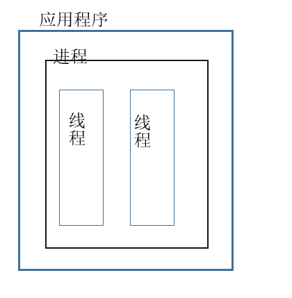
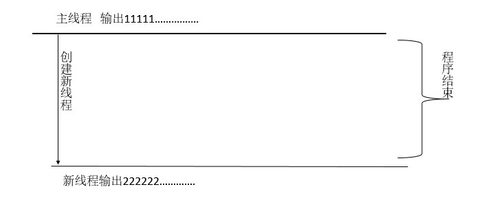
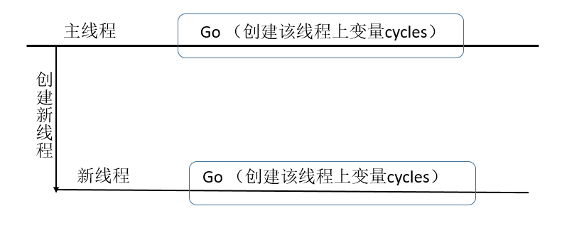

# C#的线程（一）
## 初识线程
线程是一个独立的运行单元，每个进程内部都有多个线程，每个线程都可以各自同时执行指令。每个线程都有自己独立的栈，但是与进程内的其他线程共享内存。
但是对于.NET的客户端程序（Console，WPF，WinForms）是由CLR创建的单线程（主线程，且只创建一个线程）来启动。在该线程上可以创建其他线程。


<!--## 线程 VS 进程

一个应用程序有一个进程，进程在操作系统上可以并行运行。线程在单个进程内并行运行，运行过程是完全相互隔离的，线程在一定程度上也是相互隔离的。
尤其是，线程与其他运行在同义进程中的线程共享内存。这样一个线程可以处理数据，另一个线程负责展示数据，所以多线程会更有效率。-->

图：

 ## 线程工作方式
 多线程由内部线程调度程序管理，线程调度器通常是CLR委派给操作系统的函数。线程调度程序确保所有活动线程都被分配到合适的执行时间，线程在等待或阻止时 （例如，在一个独占锁或用户输入） 不会消耗 CPU 时间。

在单处理器计算机上，线程调度程序是执行时间切片 —  迅速切换每个活动线程。在 Windows 中, 一个时间片是通常数十毫秒为单位的区域 — — 相比来说 线程间相互切换比CPU更消耗资源。

在多处理器计算机上，多线程用一种混合的时间切片和真正的并发性来实现，不同的线程会在不同的cpu运行代码。
## 创建线程
如：
``` CSharp
using System;
using System.Threading;

class ThreadTest
{
  static void Main()
  {
    Thread t = new Thread (Write2);          // 创建线程t
    t.Start();                               // 执行 Write2()
 
    // 同时执行主线程上的该方法
    for (int i = 0; i < 1000; i++) Console.Write ("1");
  }
 
  static void Write2()
  {
    for (int i = 0; i < 1000; i++) Console.Write ("2");
  }
}

//输出：
//111122221122221212122221212......
```
在主线程上创建了一个新的线程，该新线程执行WrWrite2方法，在调用t.Start()时，主线程并行，输出“1”。

图：


线程Start()之后，线程的IsAlive属性就为true，直到该线程结束（当线程传入的方法结束时，该线程就结束）。

---

## CLR使每个线程都有自己独立的内存栈，所以每个线程的本地变量都相互独立。

如：
``` CSharp
static void Main() 
{
  new Thread (Go).Start();      // 创建一个新线程，并调用Go方法
  Go();                         // 在主线程上调用Go方法
}
 
static void Go()
{
  // 声明一个本地局部变量 cycles
  for (int cycles = 0; cycles < 5; cycles++) Console.Write ('N');
}
//输出：
//NNNNNNNNNN (共输出10个N)
```
在新线程和主线程上调用Go方法时分别创建了变量cycles，这时cycles在不同的线程栈上，所以相互独立不受影响。

图：


**如果不同线程指向同一个实例的引用，那么不同的线程共享该实例。**

如：
```CSharp
class ThreadTest
{
  //全局变量
  int i;
 
  static void Main()
  {
    ThreadTest tt = new ThreadTest();   // 创建一个ThreadTest类的实例
    new Thread (tt.Go).Start();
    tt.Go();
  }
 
  // Go方法属于ThreadTest的实例
  void Go() 
  {
     if (i==1) { ++i; Console.WriteLine (i); }
  }
}
//输出：
//2
```
新线程和主线程上调用了同一个实例的Go方法，所以变量i共享。

**静态变量也可以被多线程共享**
``` CSharp
class ThreadTest 
{
  static int i;    // 静态变量可以被线程共享
 
  static void Main()
  {
    new Thread (Go).Start();
    Go();
  }
 
  static void Go()
  {
    if (i==1) { ++i; Console.WriteLine (i); }
  }
}

//输出：
//2
```

如果将Go方法的代码位置互换
``` CSharp
 static void Go()
  {
    if (i==1) {  Console.WriteLine (i);++i;}
  }

//输出：
//1
//1（有时输出一个，有时输出两个）
```
*如果新线程在Write之后，done=true之前，主线程也执行到了write那么就会有两个done。*

不同线程在读写共享字段时会出现不可控的输出，这就是多线程的线程安全问题。

解决方法： 使用排它锁来解决这个问题--lock
``` CSharp
class ThreadSafe 
{
  static bool done;
  static readonly object locker = new object();
 
  static void Main()
  {
    new Thread (Go).Start();
    Go();
  }
 
  static void Go()
  {
    //使用lock，确保一次只有一个线程执行该代码
    lock (locker)
    {
      if (!done) { Console.WriteLine ("Done"); done = true; }
    }
  }
}
```
*当多个线程都在争取这个排它锁时，一个线程获取该锁，其他线程会处于blocked状态（该状态时不消耗cpu），等待另一个线程释放锁时，捕获该锁。这就保证了一次
只有一个线程执行该代码。*

---
## Join和Sleep
Join可以实现暂停另一个线程，直到调用Join方法的线程结束。
``` CSharp
static void Main()
{
  Thread t = new Thread (Go);
  t.Start();
  t.Join();
  Console.WriteLine ("Thread t has ended!");
}
 
static void Go()
{
  for (int i = 0; i < 1000; i++) Console.Write ("y");
}

//输出：
//yyyyyy..... Thread t has ended!
```
线程t调用Join方法，阻塞主线程，直到t线程执行结束，再执行主线程。

Sleep:暂停该线程一段时间
``` CSharp
Thread.Sleep (TimeSpan.FromHours (1));  // 暂停一个小时
Thread.Sleep (500);                     // 暂停500毫秒

Join是暂停别的线程，Sleep是暂停自己线程。
```
---

上面的例子是使用Thread类的构造函数，给构造函数传入一个ThreadStart委托。来实现的。
``` CSharp
public delegate void ThreadStart();
```
然后调用Start方法，来执行该线程。委托执行完该线程也结束。

如：
``` CSharp
class ThreadTest
{
  static void Main() 
  {
    Thread t = new Thread (new ThreadStart (Go));
 
    t.Start();   // 执行Go方法
    Go();        // 同时在主线程上执行Go方法
  }
 
  static void Go()
  {
    Console.WriteLine ("hello!");
  }
}
```
多数情况下，可以不用new ThreadStart委托。直接在构造函数里传入void类型的方法。
``` CSharp
Thread t = new Thread (Go); 
```
使用lambda表达式
``` CSharp
static void Main()
{
  Thread t = new Thread ( () => Console.WriteLine ("Hello!") );
  t.Start();
}
```
---
## Foreground线程和Background线程
默认情况下创建的线程都是Foreground，只要有一个Foregournd线程在执行，应用程序就不会关闭。
Background线程则不是。一旦Foreground线程执行完，应用程序结束，background就会强制结束。
可以用IsBackground来查看该线程是什么类型的线程。

---
## 线程异常捕获
``` CSharp
public static void Main()
{
  try
  {
    new Thread (Go).Start();
  }
  catch (Exception ex)
  {
    // 不能捕获异常
    Console.WriteLine ("Exception!");
  }
}
 
static void Go() { throw null; }   //抛出 Null异常
```
此时并不能在Main方法里捕获线程Go方法的异常，如果是Thread自身的异常可以捕获。

正确捕获方式：
``` CSharp
public static void Main()
{
   new Thread (Go).Start();
}
 
static void Go()
{
  try
  {
    // ...
    throw null;    // 这个异常会被下面捕获
    // ...
  }
  catch (Exception ex)
  {
     // ...
  }
}

```
---
## 线程池

当创建一个线程时，就会消耗几百毫秒cpu，创建一些新的私有局部变量栈。每个线程还消耗（默认）约1 MB的内存。线程池通过共享和回收线程，允许在不影响性能的情况下启用多线程。
每个.NET程序都有一个线程池，线程池维护着一定数量的工作线程，这些线程等待着执行分配下来的任务。

线程池线程注意点：

    1 线程池的线程不能设置名字（导致线程调试困难）。
    2 线程池的线程都是background线程
    3 阻塞一个线程池的线程，会导致延迟。
    4 可以随意设置线程池的优先级，在回到线程池时改线程就会被重置。

通过Thread.CurrentThread.IsThreadPoolThread.可以查看该线程是否是线程池的线程。

使用线程池创建线程的方法：
 * Task
 * ThreadPool.QueueUserWorkItem
 * Asynchronous delegates
 * BackgroundWorker

**TPL**

 Framework4.0下可以使用Task来创建线程池线程。调用Task.Factory.StartNew(),传递一个委托
 * Task.Factory.StartNew

 ``` CSharp
static void Main() 
{
  Task.Factory.StartNew (Go);
}
 
static void Go()
{
  Console.WriteLine ("Hello from the thread pool!");
}

 ```
Task.Factory.StartNew 返回一个Task对象。可以调用该Task对象的Wait来等待该线程结束,调用Wait时会阻塞调用者的线程。

* Task构造函数
给Task构造函数传递Action委托，或对应的方法，调用start方法，启动任务
``` CSharp
static void Main() 
{
  Task t=new Task(Go);
  t.Start();
}
 
static void Go()
{
  Console.WriteLine ("Hello from the thread pool!");
}
```
* Task.Run
直接调用Task.Run传入方法，执行。
``` CSharp
static void Main() 
{
  Task.Run(() => Go());
}
 
static void Go()
{
  Console.WriteLine ("Hello from the thread pool!");
}
```
---

### QueueUserWorkItem
QueueUserWorkItem没有返回值。使用 QueueUserWorkItem,只需传递相应委托的方法就行。
``` CSharp
static void Main()
{
  //Go方法的参数data此时为空
  ThreadPool.QueueUserWorkItem (Go);
  //Go方法的参数data此时为123
  ThreadPool.QueueUserWorkItem (Go, 123);
  Console.ReadLine();
}
 
static void Go (object data) 
{
  Console.WriteLine ("Hello from the thread pool! " + data);
}
```
---

### 委托异步
委托异步可以返回任意类型个数的值。
使用委托异步的方式：
1. 声明一个和方法匹配的委托
2. 调用该委托的BeginInvoke方法，获取返回类型为IAsyncResult的值
3. 调用EndInvoke方法传递IAsyncResulte类型的值获取最终结果

如：
``` CSharp
static void Main()
{
  Func<string, int> method = Work;
  IAsyncResult cookie = method.BeginInvoke ("test", null, null);
  //
  // ... 此时可以同步处理其他事情
  //
  int result = method.EndInvoke (cookie);
  Console.WriteLine ("String length is: " + result);
}
 
static int Work (string s) { return s.Length; }
```
使用回调函数来简化委托的异步调用,回调函数参数为IAsyncResult类型
``` CSharp
static void Main()
{
  Func<string, int> method = Work;
  method.BeginInvoke ("test", Done, method);
  // ...
  //并行其他事情
}
 
static int Work (string s) { return s.Length; }
 
static void Done (IAsyncResult cookie)
{
  var target = (Func<string, int>) cookie.AsyncState;
  int result = target.EndInvoke (cookie);
  Console.WriteLine ("String length is: " + result);
}
```
使用匿名方法
``` CSharp
 Func<string, int> f = s => { return s.Length; };
  f.BeginInvoke("hello", arg =>
  {
      var target = (Func<string, int>)arg.AsyncState;
      int result = target.EndInvoke(arg);
      Console.WriteLine("String length is: " + result);
  }, f);
```
---

## 线程传参和线程返回值
### Thread

Thread构造函数传递方法有两种方式：
``` CSharp
public delegate void ThreadStart();
public delegate void ParameterizedThreadStart (object obj);
```
**所以Thread可以传递零个或一个参数，但是没有返回值。**

* 使用lambda表达式直接传入参数。
``` CSharp
static void Main()
{
  Thread t = new Thread ( () => Print ("Hello from t!") );
  t.Start();
}
 
static void Print (string message) 
{
  Console.WriteLine (message);
}
```
* 调用Start方法时传入参数
``` CSharp
static void Main()
{
  Thread t = new Thread (Print);
  t.Start ("Hello from t!");
}
 
static void Print (object messageObj)
{
  string message = (string) messageObj;   
  Console.WriteLine (message);
}
```

Lambda简洁高效，但是在捕获变量的时候要注意，捕获的变量是否共享。
如：
``` CSharp
for (int i = 0; i < 10; i++)
  new Thread (() => Console.Write (i)).Start();

//输出：
//0223447899
```
因为每次循环中的i都是同一个i，是共享变量，在输出的过程中，i的值会发生变化。

解决方法-局部域变量

``` CSharp
for (int i = 0; i < 10; i++)
{
  int temp = i;
  new Thread (() => Console.Write (temp)).Start();
}
```

这时每个线程都指向新的域变量temp（此时每个线程都有属于自己的花括号的域变量）在该线程中temp不受其他线程影响。

---
### 委托
委托可以有任意个传入和输出参数。以Action，Func来举例。
* Action 有零个或多个传入参数，但是没有返回值。
* Func 有零个或多个传入参数，和一个返回值。

```CSharp
  Func<string, int> method = Work;
  IAsyncResult cookie = method.BeginInvoke("test", null, null);
  //
  // ... 此时可以同步处理其他事情
  //
  int result = method.EndInvoke(cookie);
  Console.WriteLine("String length is: " + result);        

  int Work(string s) { return s.Length; }
```
使用回调函数获取返回值

``` CSharp
static void Main()
{
  Func<string, int> method = Work;
  method.BeginInvoke ("test", Done, null);
  // ...
  //并行其他事情
}
 
static int Work (string s) { return s.Length; }
 
static void Done (IAsyncResult cookie)
{
  var target = (Func<string, int>) cookie.AsyncState;
  int result = target.EndInvoke (cookie);
  Console.WriteLine ("String length is: " + result);
}
```
EndInvoke做了三件事情：
1. 等待委托异步的结束。
2. 获取返回值。
3. 抛出未处理异常给调用线程。

---
### Task
Task<TResult>泛型允许有返回值。

如：
``` CSharp
static void Main()
{
  // 创建Task并执行
  Task<string> task = Task.Factory.StartNew<string>
    ( () => DownloadString ("http://www.baidu.com") ); 
  // 同时执行其他方法
  Console.WriteLine("begin");
  //等待获取返回值，并且不会阻塞主线程
  Console.WriteLine(task.Result);
  Console.WriteLine("end");
} 
static string DownloadString (string uri)
{
  using (var wc = new System.Net.WebClient())
    return wc.DownloadString (uri);
}

``` 
---
参考：
* http://www.albahari.com/threading/
* 《C#并发编程》