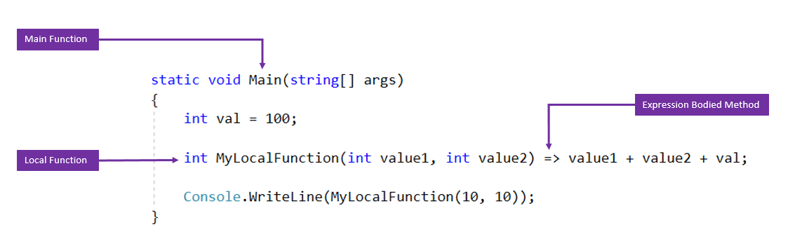

# C#7.0本地方法的表达式实现
在C#6.0中新增了本地方法（局部函数）。C#7.0又新增了几个新的特性，包括构造函数、析构函数、属性评估器等等，

我们可以用Expression来表示局部函数

局部函数
```CSharp
static void Main(string[] args)
{
    int val = 100;
    int MyLocalFunction(int value1, int value2)
    {
         return val + value1 + value2;
    }
    
    Console.WriteLine(MyLocalFunction(10, 10));
}
```
局部函数表达式
```CSharp
static void Main(string[] args)
{
    int val = 100;
    
    int MyLocalFunction(int value1, int value2) => value1 + value2 + val;
    
    Console.WriteLine(MyLocalFunction(10, 10));
}
```
