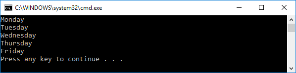

# C#基础之遍历枚举

枚举是我们在编程中最经常用到的。并且也很容易声明和使用，但是枚举的其他的一些功能方法等，我们也应该了解明白。比如：遍历枚举。当然有许多方法可以实现这个遍历。但是枚举对象自身提供了一个Enum.GetNames()方法，返回枚举对象的字符串数组。

假设我们定义如下一个枚举对象：

```CSharp
enum WorkingDays{
    Monday,
    Tuesday,
    Wednesday,
    Thursday,
    Friday
}
```

使用Enum.GetNames()方法，可以遍历枚举的每个值。该方法需要传入一个枚举对象，使用typeof关键字，强制转换为枚举。返回枚举的名称字符串数组。

如：

```Csharp
foreach (var item in Enum.GetNames(typeof(WorkingDays)))
{
Console.WriteLine(item);
}
```

运行后，输出如下：



另一种方法，是用Enum.GetValues()遍历每个枚举对象。

```CSharp
foreach (var item in Enum.GetValues(typeof(WorkingDays)))
{
Console.WriteLine(item);
}
```

该方法输出和之前的方法一样


两个方法都可以遍历枚举对象。那么问题就来了，这两个方法有什么区别吗？

GetNames()方法返回枚举的名称（Name)数组。

GetValues()方法返回枚举对象的值数组。

当我们定义数组的时候，其实我们也给每个枚举对象赋值了下标值，默认是从0开始。


当然我们也可以自定义每个对象的下标。

所以GetNames()返回Modeay,Tuesday....但是GetValues()返回的数组中是包含下标值的0，1,2,3,4，可以很容易的转换这些值

```CSharp
foreach (WorkingDays item in Enum.GetValues(typeof(WorkingDays)))
{
Console.WriteLine(Convert.ToInt32(item));
}
```

