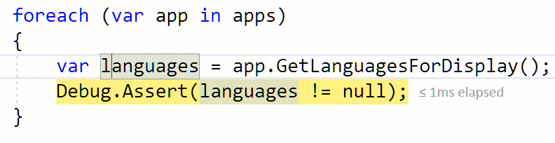
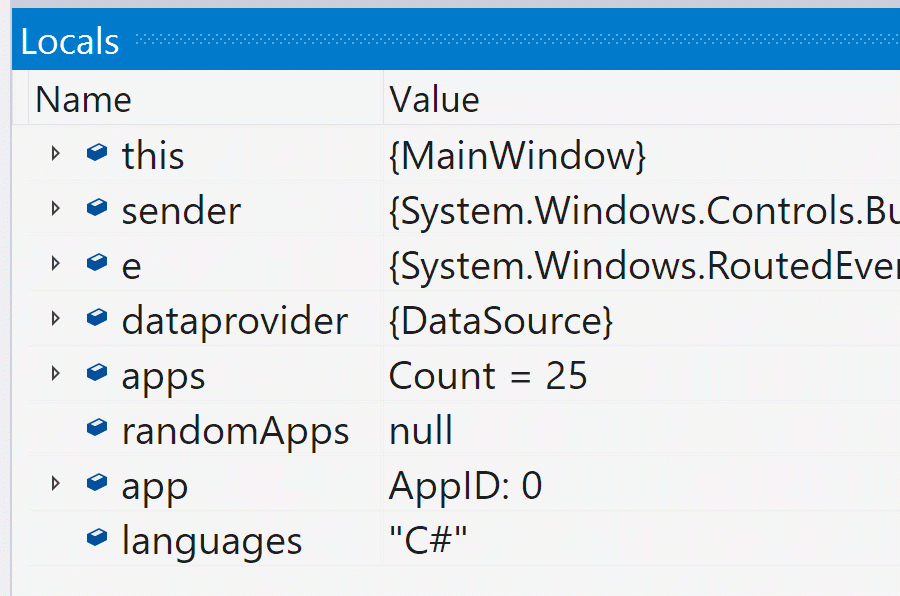
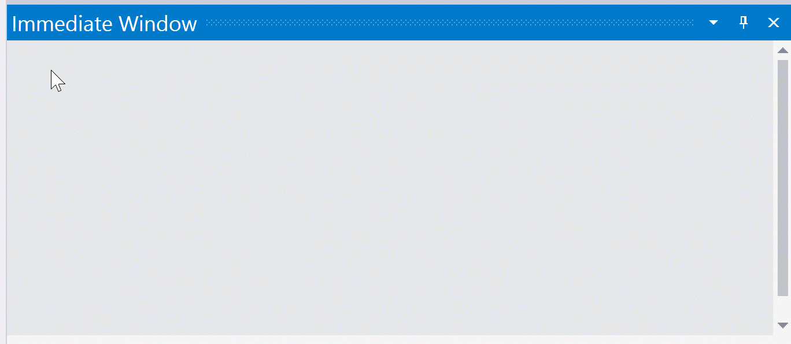
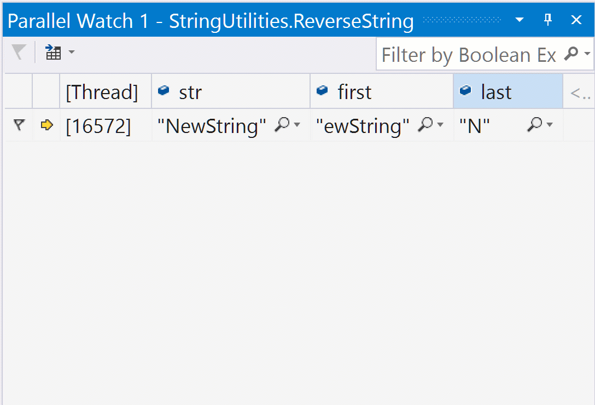
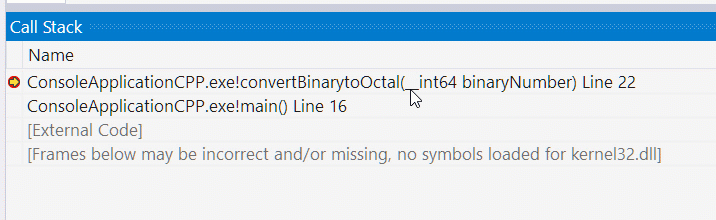
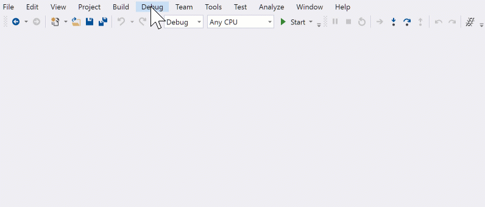
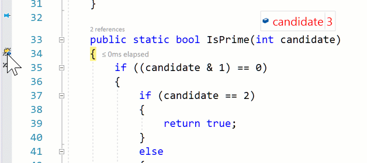
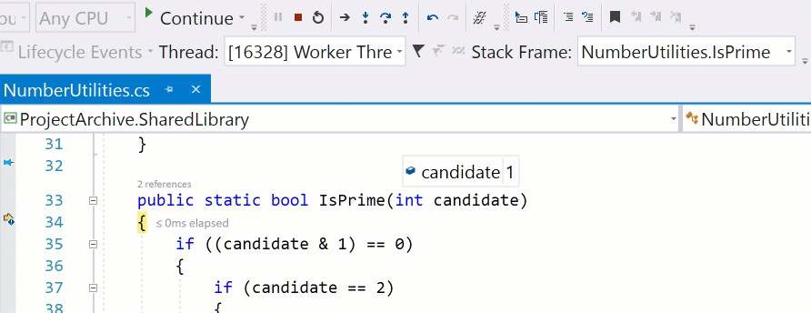
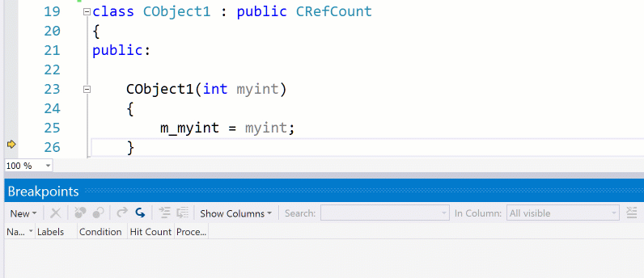

# Visual Studio调试
## 1.不修改代码直接编辑变量的值
在调试的时候，你是否遇到过调试的变量不是你预期的？，或是只是想更改一下变量的值看看有什么表现？你可以在调试时编辑内存中变量的值就可以轻松实现。
有多种方式来实现：
1.数据提示
2.局部变量
3.监视
4.即时窗口

1. 数据提示 

 鼠标指向该变量，获取到数据提示，单击该变量或者右键选择编辑，出现编辑光标，您可以为变量提供一个新值。

2. 选择局部变量或者监视

在表格中双击该变量，或右键选择编辑。这时可以给变量编辑一个新的值。

3. 即时窗口

使用代码可以给变量重新分配新值。例如，您可以键入“x = 12;”，这会将调试上下文中变量x的内存的值更改为数字12.如果在分配变量之前需要创建或操作变量，则此方法是最有益的。

## 2. 在递归函数调用中查看值
在调试递归函数时你会发现自己用了很多的Debug.WriteLine()方法来监视变量。在你的头脑中很难记住这些递归的输出值。可以使用并行监视窗口查看递归调用的变量的变化，来减轻你大脑的负担。
1. 打开调试，窗体，并行监视
2. 选择添加监视，添加要监视的变量的名称
3. 在你调试递归函数时，你就可以在这里查看变量的值的变化

## 3. 在调用堆栈中显示参数值
大多数开发人员在调试会话中使用Call Stack作为当前上下文的映射。它提供了在何处调用代码的历史记录。它可以引入额外的信息来定位自己，如参数值。

1. 右键单击“ 调用堆栈”中的一项。
2. 在上下文菜单中选择“显示参数值”选项
3. 堆栈上在输入参数后直接显示了该参数的值

注意：这可能会影响性能，可以同样的操作关闭这个参数值显示

## 4. 在方法上设置断点可以不用定位到该方法的位置
你是否曾经遇到过需要调试，但找到包含该代码的源文件不容易找到？通过设置函数断点可以在调试器不需要知道代码所在的文件和行时快速设置断点。

1. 按CTRL + B。或者选择调试 / 新建断点 / 函数断点
2. 键入设置断点的函数的名称。单击确定。
3. 开始调试，触发您的代码执行，并在您没有手动查找的源文件中的函数中命中断点。

## 5. 标记线程并将其全部运行到同一位置
调试多线程代码时，为了命中断点而采取一些措施，导致程序推进其他线程。有时候要检查一个bug，如果所有的线程都可以在同一个地方停下来，那么你可以检查当时程序的状态。一个简单的方法通过标记线程然后触发运行标记的线程到光标。

1. 找出您感兴趣的线程。您可以使用Source中的Show Threads，Parallel Debugging窗口或Threads窗口。
2. 选择图标来标记您感兴趣的线程。
3. 右键单击要检查应用程序的代码行。
4. 在上下文菜单中选择运行标记的线程到光标。

注意：当打开源中显示线程或任何线程相关窗口可见时，调试会话可能会有明显的性能影响。当您主动使用它们进行调试时，我们建议您仅选择这些功能。

## 6. 切换活动线程以查看上下文
并行监视窗口非常适用于跨线程查看许多变量，包括您尚未停止的变量。但是如何检查应用程序在指定线程上的的详细状态时呢？黄色箭头显示当前线程的当前指令，并设置调试器其余部分的上下文，监视窗口，数据提示和调用堆栈都可以显示此上下文的状态。调试器使您更容易切换到上下文。

1. 选择要检查的线程。可以使用如下设置来监视变量：Show Threads in Source, the Parallel Debugging windows, or the Threads window. 
2. 右键单击线程，然后选择切换到线程...并选择您的线程。
3. 注意黄色箭头如何更改为该线程的位置，其他窗口现在具有该上下文。

您还可以使用调试位置工具栏来切换当前的调试器上下文。单击枚举程序中的线程的下拉列表，并选择要切换到的线程。在调试位置工具栏是，如果你是从具有可见的其他线程相关的功能注意到性能影响使用的一个很好的工具。此工具栏的功能不会显着影响性能，可以作为我提到的许多线程方案的快捷方式。

## 7. C ++代码中变量值的更改时命中断点
跟踪特定变量在哪里变化的可能性很难。对于本地开发人员，有一个特殊的断点类型，即数据断点，可以帮助您跟踪由意外操作的变量引起的问题。

1. 在内存中创建对象后，停在代码中的某个地方。
2. 选择调试 / 新建断电 /数据断点
3. 写入要了解的变量的地址。例如＆MyVariableName或0x0085F918
4. 选择从您希望监视的地址开始的字节数。
5. 触发断点，调试器将停止修改该内存地址的代码行。

注意：每次开始调试时，内存地址是不同的，所以每次启动新的调试会话时，都需要清除并重置数据断点。您一次可以激活的数据断点数受到环境硬件的限制，调试器在达到此限制时会发出警告。