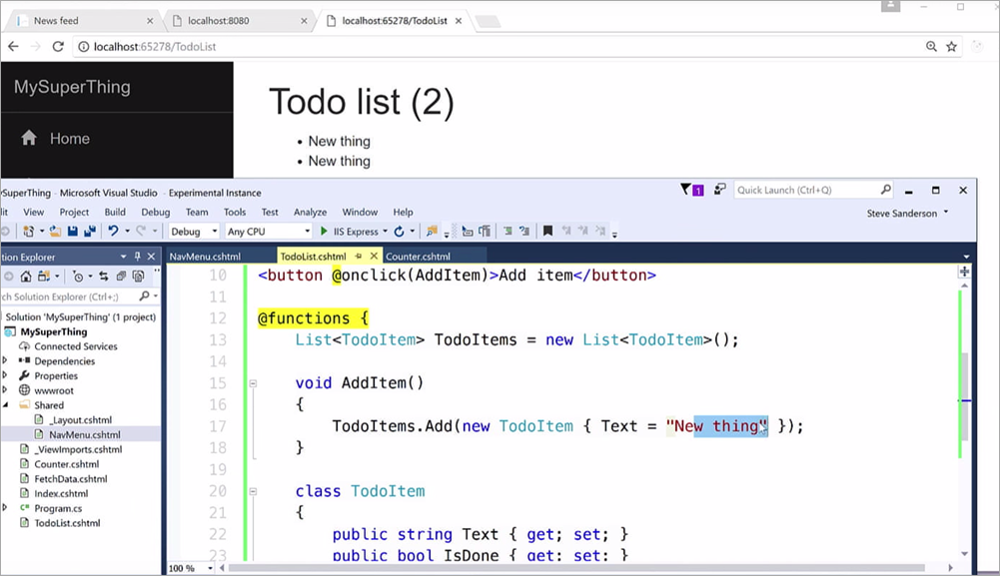

# .NET和WebAssembly-这是前端的未来吗？
*译文*

2017年，WebAssembly绝对是一件值得关注的事，您可以在http://webassembly.org上了解到相关信息。


上面的图片来自于Steve Sanderson的NDC演示。他正在开发的应用就属于典型的客户端JavaScript ToDo应用，只有一点比较例外，就是他是用C#写的代码。

## 什么是WebAssembly?

“WebAssembly或wasm是用于浏览器客户端脚本的低级字节码格式，从JavaScript演变而来。”您可以从C和C ++轻松编译到WebAssembly ...，并且每天都有更多的语言加入到包含WebAssembly的项目中。

我在开源.NET中工作，由于.NET Core 2.0具有跨平台特性，因此值得探讨WebAssembly和.NET的发展。

以下是一些我认为有助于在.NET和WebAssembly之间架起桥梁的项目。我认为这将是未来18个月的热点。

## .NET的WebAssembly

这个OSS项目是为了消耗WASM的二进制文件，在.NET程序集中执行 。需要说明，它不是把.NET语言（C＃，VB.NET，F＃）编译到WebAssembly中，而是为了使用WebAssembly，就像任何其他可重用的编译的底层代码一样。现在有一个可以在.NET中调用的WASM文件，你想用吗？它就是实现了这个功能。

有趣的是，这个项目并没有启动V8或Chakra JavaScript引擎来运行WASM，相反，而是用字节码对它进行读取，然后通过System.Reflection.Emit把它们给转换成.NET。

## Mono和WebAssembly

在.NET生态系统中正在发生一件巨大事情，就是今天有不止一个“.NET”。在过去，.NET您只能在Windows上安装。今天，基本上每个Windows机器上都有.NET 4.x +，还可以在Docker，Mac，Windows和Linux中可以运行.NET Core，甚至是Raspberry Pi，而Mono是.NET的另一个允许您在其他平台中运行代码的实例。

Mono项目有Mono和WebAssembly两个原型。

> 第一个使用Mono的传统完全静态编译模式，将Mono C 运行时和Mono类库以及用户代码编译成WebAssembly代码。它生成一个较大的静态编译应用程序。

所以这是一个完全静态编译的Hello World。它是所有的Mono和你的应用程序编译为Web Assembly。另一个原型与这个有一些不同：

> 第二个原型将Mono C 运行时编译成WebAssenmbly，然后使用Mono的IL解释器来运行托管代码。虽然很小，但是牺牲了性能。

就是这样在Web Assembly中运行Mono，但是被解释执行的是您的IL代码。

## "BLAZOR" -在浏览器中运行.NET的实验UI框架

作为Mono Project的第二个原型，Steve Sanderson采用了类似的想法，开源了6年的DotNetAnywhere（DNA）项目能把.NET其编译成Web Assembly。DNA是一个用便携式C编写的解释型.NET运行时。它采用标准IL或CIL（通用中间语言），并在资源受限的设备上运行它，因为它不可能运行完整的.NET运行时（例如Mono）。如浏览器已经具有的JavaScript虚拟机。

在某些Razor（基本上是带有C＃内联的HTML）页面，它实现了一个看起来像后台的调用。这是C＃代码，但它将在Blazor应用程序的客户端运行为WASM。
```CSharp
@functions {
    WeatherForecast[] forecasts;
 
    override protected async Task InitAsync()
    {
        using (var client = new HttpClient())
        {
            var json = await client.GetStringAsync(AbsoluteUrl("/api/SampleData/WeatherForecasts"));
            forecasts = JsonUtil.Deserialize<WeatherForecast[]>(json);
        }
    }
}
```

这将允许.NET程序员在客户端和服务器上使用相同的数据模型 - 就像今天应该很有规律的JavaScript - 就像使用他们可能熟悉的其他.NET库一样。

正在有越来越多的语言，框架加入实现WebAssembly。


