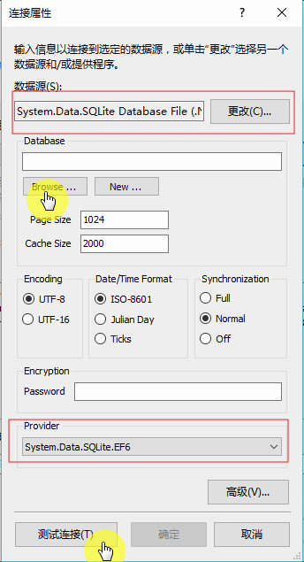

# Entity Framework+Sqlite+DataBaseFirst
本篇主要是说明如果配置在vs中配置Sqlite，及如何使用Entity Framework DataBaseFirst模式。

如果没有下载vs对应的sqlite工具，在vs里的数据连接里是找不到sqlite数据源这一项的。

图：

## VS配置Sqlite
在[官网](http://system.data.sqlite.org/index.html/doc/trunk/www/downloads.wiki)中找到sqlite对应的VS下载文件，选择含有“ bundle-x86”字符的文件下载。如vs2015，就下载“sqlite-netFx46-setup-bundle-x86-2015-1.0.104.0.exe 
(16.91 MiB)	”文件。重启VS，在‘服务资源管理器’，右键单击‘添加链接’，选择‘更改数据源’，在弹出的窗体可以发现多了一项sqlite数据源。

---
## VS链接Sqlite
VS里新建控制台引用程序。项目名称上右键选择‘管理nuget包’。选择‘浏览’，搜索sqlite，找到对应System.Data.Sqlite安装包（这是Sqlite官方维护的包）。
这时该项目的引用里已经添加了
* System.Data.SQLite
* EntityFramework
* EntityFramework.SqlsSrver
* System.Data.SQLite.EF6
* System.Data.SQLite.Linq

*后面几个是System.Data.SQLite依赖的安装包，添加System.Data.SQLite会自动添加该几项*

同时也自动生成了App.Config文件（配置信息也自动配置完成，很方便）。
新建Sqlite数据库(使用命令，或者数据库管理工具：SqliteExpert,Navicat For Sqite)。

在项目中选择在‘服务资源管理器’，右键单击‘添加链接’，选择‘更改数据源’，选择‘Sqlite’，选择‘Browser’找到数据库。测试链接，成功。
在Sqlite数据库中添加表和字段。

图:

在项目上右键‘添加’，‘新建项’，选择‘ADO.NET 实体数据模型’

图：

选择‘来自数据库的EF设计器’，单击‘下一步’。

选择‘新建链接’

Browse对应数据库。

‘测试链接’-成功。

单击‘确定’。

选择如图所示标红项

单击‘完成’。

vs里自动生成如下项：

数据库的操作类和连接方法，及和表对应的类，也自动生成。

图：

图：

构造函数的参数就是数据库的连接字符串，和App.config中的连接字符串相对应。

图：

至此，连接完成。

## 操作Sqlite
