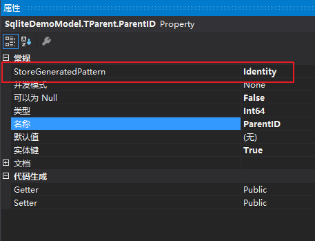

# Entity Framework+Sqlite+DataBaseFirst
本篇主要是说明在vs中配置Sqlite，及使用Entity Framework DataBaseFirst模式。

如果没有下载vs对应的sqlite工具，在vs里的数据连接里是找不到sqlite数据源这一项的。

图：


---
## VS配置Sqlite
在[官网](http://system.data.sqlite.org/index.html/doc/trunk/www/downloads.wiki)中找到sqlite对应的VS下载文件，选择含有“ bundle-x86”字符的文件下载。如vs2015，就下载“sqlite-netFx46-setup-bundle-x86-2015-1.0.104.0.exe 
(16.91 MiB)	”文件。重启VS，在‘服务资源管理器’，右键单击‘添加链接’，选择‘更改数据源’，在弹出的窗体可以发现多了一项sqlite数据源。


---
## VS链接Sqlite
**添加Sqlite包**

VS里新建控制台引用程序。项目名称上右键选择‘管理nuget包’。选择‘浏览’，搜索sqlite，找到对应System.Data.Sqlite安装包（这是Sqlite官方维护的包）。
完成安装该项目会添加如下几项引用
* System.Data.SQLite
* EntityFramework
* EntityFramework.SqlsSrver
* System.Data.SQLite.EF6
* System.Data.SQLite.Linq

*后面几个是System.Data.SQLite依赖的安装包，添加System.Data.SQLite会自动添加该几项*

同时也自动生成了App.Config文件（配置信息也自动配置完成，很方便）。

**DataBaseFirst**

首先创建数据库，设计表和字段。

图:

图:

<!--再在项目中选择在‘服务资源管理器’，右键单击‘添加链接’，选择‘更改数据源’，选择‘Sqlite’，选择‘Browser’找到数据库。测试链接，成功。
在Sqlite数据库中添加表和字段。-->
在项目上右键‘添加’，‘新建项’，选择‘ADO.NET 实体数据模型’

图：

选择‘来自数据库的EF设计器’，单击‘下一步’。


选择‘新建链接’,更改数据源为 **System.Data.SQLite DataBase File**


Browse找到对应数据库。

单击‘测试链接’-检测是否链接成功。

单击‘确定’。

选择如图所示标红项


单击‘完成’。

vs里自动生成如下项：


数据库的操作类和连接方法，及和表对应的类，也自动生成。

图：
构造函数的参数就是数据库的连接字符串，和App.config中的连接字符串相对应。

图：

图：


App.Config配置文件如下：
``` XML
<?xml version="1.0" encoding="utf-8"?>
<configuration>
  <configSections>
    <!-- For more information on Entity Framework configuration, visit http://go.microsoft.com/fwlink/?LinkID=237468 -->
    <section name="entityFramework" type="System.Data.Entity.Internal.ConfigFile.EntityFrameworkSection, EntityFramework, Version=6.0.0.0, Culture=neutral, PublicKeyToken=b77a5c561934e089" requirePermission="false" />
  </configSections>
  <startup>
    <supportedRuntime version="v4.0" sku=".NETFramework,Version=v4.5.2" />
  </startup>
  <entityFramework>
    <defaultConnectionFactory type="System.Data.Entity.Infrastructure.LocalDbConnectionFactory, EntityFramework">
      <parameters>
        <parameter value="v13.0" />
      </parameters>
    </defaultConnectionFactory>
    <providers>
      <provider invariantName="System.Data.SqlClient" type="System.Data.Entity.SqlServer.SqlProviderServices, EntityFramework.SqlServer" />
      <provider invariantName="System.Data.SQLite.EF6" type="System.Data.SQLite.EF6.SQLiteProviderServices, System.Data.SQLite.EF6" />
    </providers>
  </entityFramework>
  <system.data>
    <DbProviderFactories>
      <remove invariant="System.Data.SQLite.EF6" />
      <add name="SQLite Data Provider (Entity Framework 6)" invariant="System.Data.SQLite.EF6" description=".NET Framework Data Provider for SQLite (Entity Framework 6)" type="System.Data.SQLite.EF6.SQLiteProviderFactory, System.Data.SQLite.EF6" />
      <remove invariant="System.Data.SQLite" />
      <add name="SQLite Data Provider" invariant="System.Data.SQLite" description=".NET Framework Data Provider for SQLite" type="System.Data.SQLite.SQLiteFactory, System.Data.SQLite" />
    </DbProviderFactories>
  </system.data>
  <connectionStrings>
    <add name="SqliteDemoEntities" connectionString="metadata=res://*/SqliteDemo.csdl|res://*/SqliteDemo.ssdl|res://*/SqliteDemo.msl;provider=System.Data.SQLite.EF6;provider connection string=&quot;data source=E:\SqliteDemo.db&quot;" providerName="System.Data.EntityClient" />
  </connectionStrings>
</configuration>
```
至此，连接完成。

---
## 操作Sqlite
如：
``` CSharp
    class Program
    {
        static void Main(string[] args)
        {
            using (SqliteDemoEntities entity = new SqliteDemoEntities())
            {
                TParent parent = new TParent
                {
                    Name = "God",
                    Age = 88,
                    Address = "China"
                };
                entity.TParent.Add(parent);
                TChildren child = new TChildren
                {
                    Address = "China",
                    Age = 10,
                    Name = "XiaoMing",
                    TParent = parent
            };
            entity.TChildren.Add(child);

            entity.SaveChanges();
            Console.WriteLine("Parents");
            foreach (var p in entity.TParent)
            {

                Console.Write("name: " + p.Name + " ID " + p.ParentID + " Age " + p.Age + " address " + p.Address);
            }
            Console.WriteLine("Children");
            foreach (var c in entity.TChildren)
            {

                Console.Write("name: " + c.Name + " ID " + c.ParentID + " Age " + c.Age + " address " + c.Address);
            }
        }
    }
}
```
**如果数据库中的字段设置为自增的话，那么在代码里需要更改该字段的属性。**

图：


---
**如果数据库在一个单独dll中，那么在控制台的dll也要添加sqlite包，最重要的是要把数据库dll的配置文件（App.Config）信息拷贝到控制台的App.Config文件中**

注意：
* 这里Sqlite数据连接字符串使用的是绝对路径
* App.Config使用的都是默认的配置
* 数据库中的主键为自增