# Visual Studio 2015-调试期间性能分析

*Charles Willis,Dan Taylor*

许多开发人员在应用程序正常运行上花了大量的时间。但在应用程序性能上却关注的很少。虽然在Visual Studio中已经有了一些分析工具，但是它们是一组独立的需要再学习的工具。当性能问题出现时，许多开发人员不愿意花时间去学习和使用它们。

本文介绍Visual Studio 2015中引入新的诊断工具调试器窗口。及如何使用它作为调试工作流程来分析常规部分的性能。首先，我将概述调试器的特性和功能，然后进行深入的介绍。我将向您展示如何在断点和步骤之间使用PerfTips，如何使用诊断工具窗口监视CPU和内存，以及如何使用快照深入分析内存增长和泄漏的问题。

本文的特性可以用于调试大多数受管理的和本地项目。微软不断增加对更多项目类型和调试配置的支持。有关当前支持的功能的最新信息，请查看aka.ms/diagtoolswindow上的诊断工具窗口上的博客文章。本文中的另一篇文章将解释如何在诊断工具窗口中使用IntelliTrace(请参阅“使用IntelliTrace来更快地诊断问题”)，以快速确定代码中错误的根源。

## 调试期间的性能

您不需要运行一个完整的分析工具，您可能需要一个或多个以下步骤:

1. 将代码插入到一个应用程序中(比如System.Diagnostics.Stop­watch)，以测量在不同的断点之间花费的时间，有时还需要在StopWatch之间在添加几个Stopwatch来定位问题。
2. 调试代码查看是否有任何特定的步骤让程序“感觉缓慢”。
3. 随机的在任意的断点处暂停调试，以了解执行进度有多远。在某些圈子里，这被称为“穷人的抽样”。
4. 过度优化代码，而不度量性能，有时通过在整个代码库中应用一组性能最佳实践。

如果没有充分的利用调试时间或者其他调试方法的，调试的结果往往是不准确的。这就是为什么现在的调试器有性能工具。在正常的调试过程中，它们将帮助你理解应用程序的性能。

### 诊断工具窗口

在Visual Studio 2015中调试代码时，您将注意到的主要区别是新的诊断工具窗口，如图1所示。这些诊断工具以两种互补的方式呈现信息。它们在窗口的上半部分提供图表信息，在底部的选项卡中提供详细信息。

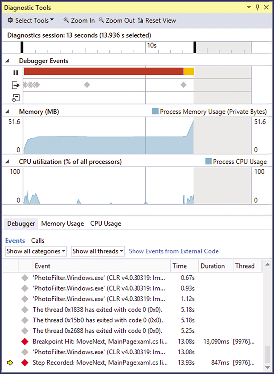

在Visual Studio 2015中，诊断工具窗口有三个工具:调试器(包括IntelliTrace)、进程内存和CPU。通过单击“选择工具”下拉菜单，您可以启用或禁用CPU和进程内存工具。调试器工具有三个轨迹分别是中断事件、输出事件和IntelliTrace事件。

### Break Events History and PerfTips 

中断事件让您可以看到每个代码段运行了多长时间。这些矩形表示应用程序启动或恢复执行的持续时间，直到调试器暂停执行

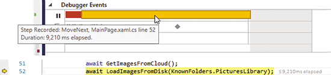

矩形的起点表示您使用Continue(F5)、逐步(F10、F11、Shift+F11)或运行到光标(Ctrl+F10)命令开始运行应用程序。矩形的终点表示应用程序停止了，比如它碰到了断点，完成了一个步骤，或者你使用了暂停。

最近的中断事件的持续时间也会显示在调试器的当前行末尾的代码中。这叫做PerfTips。它可以让你关注性能的同时，也能关注到你的代码。

在图表下方的细节表中，您还可以看到中断事件的历史和持续时间，以及以表格形式展示的perfTips。如果您有IntelliTrace，则会在表中显示其他事件。您可以使用过滤器在调试器中只查看中断事件的历史。

### CPU和进程内存

当设置断点和步骤时，时间轴会自动选择时间范围。当您遇到一个断点时，当前的时间范围被重新设置为仅显示最近的中断事件。选择可以扩展为包含最新的中断事件。你可以通过点击一个中断事件的矩形或者在时间轴上点击拖动来覆盖自动时间范围的选择。

时间范围选择使您能够关联CPU使用和内存使用图表的范围，以便您能够理解特定代码段的CPU和内存特征。在应用程序运行时，这些图形会继续更新，当你与应用程序交互时，你可以随时关注CPU和内存，你可以切换到内存使用选项卡，查看快照，查看内存使用情况的详细情况。

### IntelliTrace的性能洞察力

IntelliTrace的性能洞察力(在Visual Studio社区版本中无法使用)让您在调试托管代码时获得更多的性能。IntelliTrace在调试器事件时间轴上添加了两个跟踪:输出跟踪和IntelliTrace跟踪。这些事件包括在输出窗口中显示的信息，以及由IntelliTrace收集的附加事件，如异常，ADO等等。这些轨迹中的事件也会显示在调试器事件表中。

您可以将IntelliTrace事件与CPU使用量峰值和内存使用图联系起来。时间戳显示你的应用程序中不同的动作有多长。例如，您可以添加调试。在代码中编写WriteLine语句，并在输出事件上使用时间戳，看看从一个语句到下一个语句需要多长时间。

**内存和性能的提升**

现在您已经了解了性能分析窗口的特性，我们将深入了解这些工具的实际用途。在本节中，我们将在一个名为PhotoFilter的示例应用程序中解决一组性能问题。这个应用程序从云端下载图片，并从用户的本地图片库中加载图片，这样他就可以查看这些图片并应用图像过滤器。

aka.ms / diagtoolswndsample下载源代码。您会注意到性能的数字不一样，因为在不同的机器上性能是不同的。甚至每次运行都不一样。

**应用程序启动缓慢**

当您开始调试PhotoFilter应用程序时，您会发现应用程序启动和加载图片需要很长时间。这很明显是一个问题。

当您调试应用程序的功能问题时，您通常会有一个假设，并基于此进行调试。在这种情况下，您可以假设图片的加载速度很慢，尝试设置一个测试该假设的断点,LoadImages方法是一个很好的设置断点的地方.

在LoadImages函数的开始和结束处设置一个断点(如图3中的代码所示)，并开始调试(F5)。当代码到达第一个断点时，按继续(F5)再次运行到第二个断点。现在在调试器事件时间轴上有两个中断事件。

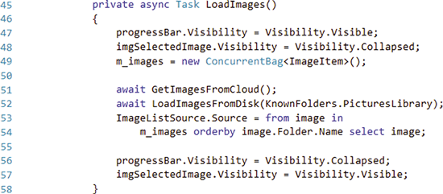

第一步显示应用程序在到达第一个断点之前只运行了274毫秒。第二个显示，在到达第二个断点之前，运行LoadImages函数花费了10476 ms。您还可以在代码断点处中看到运行时间。所以你把这个问题缩小到LoadImages函数。

要获得更多的信息和每一行需要多长时间，重新启动调试，这样您就再次遇到了第一个断点。这一次，遍历方法中的每一行代码，看看哪些行最长。从调试中断事件的性能和持续时间来看，您可以看到GetImagesFromCloud需要7290 ms，loadimagesfrom磁盘需要736 ms，而LINQ查询需要1322 ms，其余的则需要少于50 ms。

所有行的计时如图4所示。所显示的行数表示中断事件的结束线，因此第52行表示在51行上花费了多长时间。现在进一步深入到GetImagesFromCloud方法中。

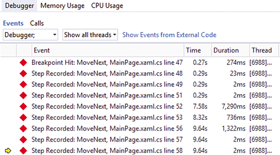

GetImagesFromCloud方法执行两个逻辑上独立的操作，如图5所示。它从服务器上下载图片列表，再一个个的下载图片的缩略图。您可以通过取消现有的断点并在以下行中放置新的断点来执行这两种操作。

```CSharp
line 63: HttpClient client = new HttpClient();
line 73: foreach (var image in pictureList)
line 79: }
```

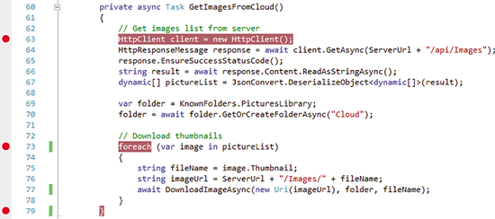

重新启动调试过程，等待应用程序到达第一个断点。然后让应用程序运行(按下F5继续)到第二个断点。这可以让应用程序从云端获取图片列表。然后让应用程序运行到第二个断点，以度量从云中下载缩略图的时间。从PerfTips和中断事件看出下载图片列表需要565 ms，下载缩略图需要6426 ms。所以性能瓶颈在缩略图下载中。

您查看CPU图表(如图6所示)，发现当执行下载图像列表方法时，它相对较高。当缩略图下载时，图是相当平坦的，这表明这个过程在网络输入/输出上花费了很长时间。

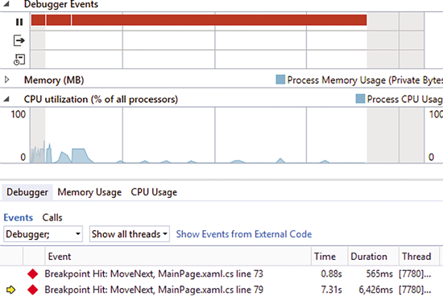

为了最小化等待客户机和服务器之间往返的时间，请立即启动所有的缩略图下载操作，等待它们完成，等待完成。用下面的代码替换第73到79行(从图5中的代码)

```CSharp
// Download thumbnails
var downloadTasks = new List<Task>();
foreach (var image in pictureList)
{
  string fileName = image.Thumbnail;
  string imageUrl = ServerUrl + "/Images/" + fileName;
  downloadTasks.Add(DownloadImageAsync(new Uri(imageUrl), folder, fileName));
}
await Task.WhenAll(downloadTasks);
```

当您使用这个新版本时，您可以看到它只需要2424毫秒的运行时间。这差不多提升了四秒钟。

### 调试内存增长和泄漏

如果您在诊断缓慢启动时查看了内存使用图表，您可能已注意到应用程序启动时内存使用量急剧增加。缩略图列表是一个虚拟化列表，一次只显示一个全尺寸图像。使用虚拟化列表的优点之一是它仅加载显示在屏幕上的内容，因此您肯定不希望在内存中一次加载许多缩略图。

要解决这个问题，您首先必须在代码中找到内存增长发生的地方。然后，在增长前后拍摄快照。比较这些快照，找到内存增长影响最大的对象类型。

“进程内存”图表显示了应用程序如何使用内存的高级视图。图表上有一个名为“专用字节”的性能计数器。专用字节是分配给进程的内存总量的量度。这不包括与其他进程共享的内存。它包括托管堆，本机堆，线程堆栈和其他内存（如加载的.dll文件的私有部分）。

在开发新应用程序或诊断现有问题时，“进程内存”图表上的意外增长通常是您的代码不符合预期的第一个迹象。看图表，您可以使用Debugger功能，如断点和逐步来缩小相关的代码。您可以从图4中的“调试器事件”选项卡中显示的行号和持续时间确定使得内存意外增长的行是第52行，LoadImagesFromDisk方法调用。当有意外的内存使用发生时，截取快照通常可以提供精确定位。在“内存使用率”选项中，单击“截取快照”按钮以生成堆的快照。您可以在断点或应用程序运行时截取快照。

如果你知道哪一行代码引起了内存使用率的尖峰，那么你就应该想到快照。在LoadImagesFromDisk方法上设置断点，并在代码到达断点时拍摄快照。此快照作为基准。

接下来，逐步运行LoadImagesFromDisk方法，并再次创建一个快照。现在，通过分割快照，您可以看到哪些托管类型已经被添加到堆中。该图再次显示您正在调查的内存利用率峰值（如图7所示）。您还可以通过将鼠标悬停在内存图表上，显示内存为47.4MB。

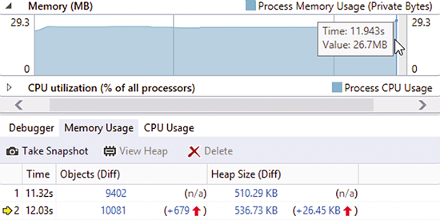

图7内存使用中有明显的尖峰

详细信息视图显示每个快照的简要概述。概述包括快照的顺序号，拍摄快照的运行时间（以秒为单位），堆的大小和堆上的活动对象数。随后的快照也将显示上一个快照中的大小和对象计数的更改。

截取快照的过程仅枚举仍然存在于堆上的对象。换句话说，如果一个对象可以被垃圾回收，那么它不会包含在快照中。这样，您不需要担心最后一次运行的集合。每个快照中的数据就好像发生了垃圾回收。

快照概述中显示的堆的大小将低于“进程内存”图表中显示的专用字节数。当专用字节概述显示进程分配的所有类型的内存时，快照显示受管堆上所有活动对象的大小。如果“进程内存”图显示出大幅增长，但是托管堆中的内存并没有大幅增长，有可能是内存中其他地方的增长。

从快照概述中，您可以打开“堆”视图，并按类型查看堆的内容。单击对象（Diff）列中的第二个快照的差异链接，以在新选项卡中打开堆视图。单击该链接将按照从上一个快照创建的新对象的数量对堆视图中的类型进行排序。这将您感兴趣的类型放在桌面的顶部。

堆视图快照（见图8）有两个主要部分：顶部窗格中的“对象类型”表和下部窗格中的“引用图”。对象类型表显示拍摄快照时每个对象类型的名称，数量和大小。

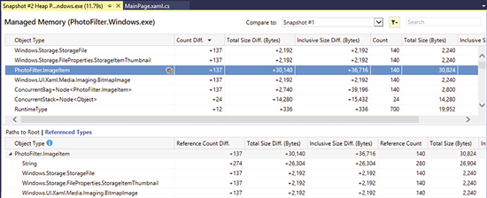
图8堆模式中的堆视图快照

堆图中的几种类型来自框架。如果您启用了Just My Code（默认值），则这些类型可以引用代码中的引用类型，也可以由代码中的类型引用。使用此视图，您可以从表格顶部的代码PhotoFilter.ImageItem中识别类型。

在图8中，您可以看到Count Diff列显示了自上一个快照创建的137个新的ImageItem对象。前五个新对象类型都具有相同数量的新对象，因此这些对象可能相关。

我们来看看第二个窗格“参考图”。如果您希望类型已被垃圾收集器清理，但仍显示在“类型”表中，“路径到根”可以帮助您跟踪保留引用的内容。“Root”的路径是“引用”图中的两个视图之一。Root的路径是一个自下而上的树，显示生成所选类型的类型的完整图形。如果另一个活动对象持有引用，则对象是有根的。不必要的根对象通常会导致托管代码中内存泄漏。

参考类型，另一种试图，正好相反。对于在“对象类型”表中选择的类型，此视图显示您选择的类型所引用的其他类型。该信息可用于确定所选类型的对象为什么保持比预期更多的内存。这在当前的调查中是有用的，因为这些类型可能使用比预期更多的内存，但它们并不比它们的有用性要好。

在对象类型表中选择PhotoFilter.ImageItem行。参考图将更新以显示ImageItem的图形。在“引用类型”视图中，您可以看到ImageItem对象总共保留了280个字符串对象，以及三种框架类型中的140个：StorageFile，StorageItemThumbnail和BitmapImage。

总大小使它看起来像是String对象对ImageItem对象保留的内存增加最多。关注总大小差异列（Diff column）很有意义，但是这个数字本身并不会让你找到你的问题的根本原因。像BitmapImage这样的一些框架类型在托管堆上只占有少量的总内存。BitmapImage实例的数量是一个更有说服力的线索。记住PhotoFilter中的缩略图列表是虚拟化的，因此它应该按需加载这些图像，并在完成后使其可用于垃圾回收。然而，它看起来好像所有缩略图都提前加载。结合您现在所知道的BitmapImage对象是冰山（icebergs)，继续调查重点。

右键单击“引用图”中的PhotoFilter.ImageItem，然后选择“转到定义”，在编辑器中打开ImageItem的源文件。ImageItem定义了一个成员字段m_photo，它是一个BitmapImage，如图9所示。

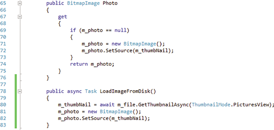
图9代码引用m_photo成员字段

引用m_photo的第一个代码路径是Photo属性的get方法，它绑定到了UI中的ListView。看起来是按需加载了BitmapImage（并因此在本机堆上解码）。

引用m_photo的第二个代码路径是LoadImageFromDisk函数。该项目在应用程序的启动路径上。随着应用程序的启动，每个显示的图像都会调用它。这有效地预加载了所有BitmapImage对象。无论ListView是否显示图像缩略图，此行为都适用于虚拟化ListView，因为所有内存都已被分配。但此预加载算法不能很好地扩展。您的图片库中拥有的图像越多，启动内存的成本就越高。所以BitmapImage对象的按需加载是更好的解决方案。

停止调试器后，请注释LoadImageFromDisk中加载BitmapImage实例的行81和82。要验证您是否已经修复了内存性能问题，而不会破坏应用程序的功能，请重新运行相同的实验。

按F5，您将看到图中的总内存使用量现在只有26.7MB（见图10）。在调用LoadImagesFromDisk之前和之后立即采取另一组快照，然后将它们区分开来。你会看到仍然有137个ImageItem对象，但没有BitmapImages（见图11）。一旦您让应用继续启动，BitmapImages将按需加载。

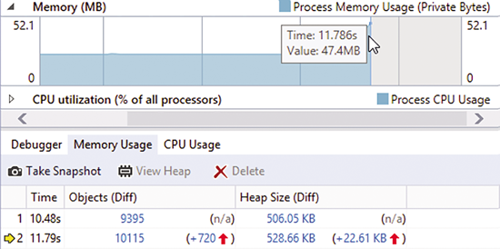
图10修复参考文献后的内存图

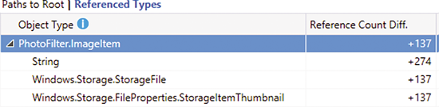
图11修复内存问题后的参考图

如前所述，此调试器集成工具还支持捕获本机堆的快照，或同时捕获托管堆和本机堆的快照。您所配置的堆是基于您正在使用的调试器：

* 仅受管理的调试器仅捕获受管理堆的快照。
* 纯本机调试器（本机项目的默认值）只会捕获本机堆的快照。
* 混合模式调试器将捕获托管和本机堆的快照。

您可以在项目属性的“调试”页面上调整此设置。

---

### 何时运行没有调试的工具

很重要的一点是，当您使用调试器来度量性能时，会引入额外的开销。主要的开销来自于一个事实，那就是你通常会运行一个应用程序的调试版本，你发布给用户的应用程序将会是一个发布版本。

在Debug构建中，编译器将结构和行为方面的可执行文件尽可能靠近原始源代码。一切都应该按照你期望的调试工作。另一方面，Release版本尝试以降低调试体验的方式优化性能代码。一些示例包括内嵌函数调用和常量变量，删除未使用的变量和代码路径，并以调试器可能无法读取的方式存储变量信息。

所有这些意味着CPU密集型代码有时可能会在Debug构建中运行得更慢。非CPU密集型操作（如磁盘I / O和网络呼叫）在两个版本下将花费相同的时间。内存行为通常不会有很大差异，这意味着Debug版本的泄露的内存也会在Release版本中泄漏，而且在这两种情况下，低效的使用内存仍将增长内存。

当附加到目标应用程序时，调试器会添加另一个需要考虑的开销类。调试器拦截模块加载和异常等事件。它还需要让您设置断点和逐步执行的其他工作。Visual Studio尽力从性能工具中过滤这种类型的开销，但仍然会有少量的开销。

您会发现如果应用程序发布版本中出现问题，那么在调试版本都会重现，但反过来，则不一定会出现。因此，调试器集成工具旨在帮助您在开发过程中主动发现性能问题。如果您在Debug构建中发现问题，则可以转到Release构建，以查看问题是否也会影响Release版本。然而,如果你决定做好预防工作(即降低遇到性能问题的几率),你可能会决定在调试版本继续解决问题，如果您确定这个问题是非cpu密集型的(磁盘或网络输入/输出)，或者您想要加快调试构建，那么您的应用程序在开发过程中会更快捷。

在发布版本中出现性能问题时，您需要确保您可以重现并验证是否已解决问题。执行此操作的最佳方法是将您的构建转移到“发布”模式，并在与出现的问题密切相关的环境中运行没有调试器的工具。

如果您正在尝试度量操作的持续时间，那么调试器集成的工具只能提供几十毫秒内的准确行，因为它的开销很小。如果您需要更高的精度，那么在没有调试器的情况下运行工具是更好的选择。

---

## 总结

您可以通过下载Visual Studio 2015 RC在Visual Studio 2015中尝试新的诊断工具调试器窗口。使用这些新的集成调试工具可以帮助您在调试应用程序时提高性能。