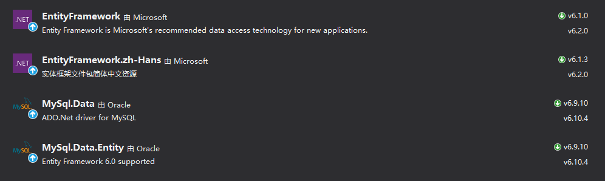

# Entity Framework6使用MySql

## MySql在Windows平台上的安装

在[官网](https://dev.mysql.com/downloads/windows/installer/5.5.html)下载安装MySql。按默认选择项，一直下一步，直到完成。

如果要在Visual Studio使用Entity Framework还需要安装一个[Connector/Net](https://dev.mysql.com/downloads/connector/net/).

使用Entity Framework6. DataBase First时，不能使用太高的Entity Framework6版本。否则会出现“实体框架版本太新，且没有兼容版本”

建议使用如下版本

* Entity Framework 6 使用 6.1.0
* MySql.Data    使用6.9.10
* MySql.Data.Entity    使用6.9.10

通过Nuget安装如上版本。重新生成编译。

---

在生成Sql对象时会有如下错误：

“MySQL - Entity : The value for column 'IsPrimaryKey' in table 'TableDetails' is DBNull”

这时MySql的一个bug。
解决方案为：在对应的数据中执行`set global optimizer_switch='derived_merge=OFF';`命令。再重新连接MySql。
 
 那么如何执行该命令呢？

 首先找到MySql的安装位置。比如：`C:\Program Files\MySQL\MySQL Server 5.7\bin`。在该目录下打开CMD或powerShell.(可以在该目录下按住Shit，单击鼠标邮件，此时上下文中会有`在此处打开PowerShell窗口`选项)。

 输入命令`mysql -u root -p`连接mysql。如果此时提示mysql不是内部或外部命令，是因为Mysql没有添加环境变量。

 添加环境变量。

 右键计算机，属性，高级系统设置，高级，环境变量。在系统变量中找到path，双击，新建，填入Mysql安装地址如：`C:\Program Files\MySQL\MySQL Server 5.7\bin`确定完成环境变量设置。

 此时在命令窗口中再次输入`mysql -u root -p`命令。输入密码。
 输入命令`use mydatabase;`该数据库名称为待使用的数据库。
 命令窗口输出 database change
 再输入命令`set global optimizer_switch='derived_merge=OFF';`

 到此完成MySql Entity Framework6的连接。

