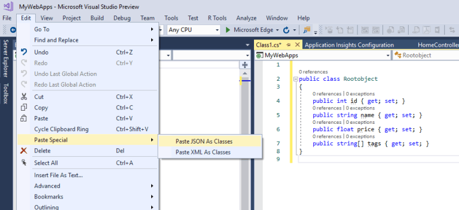
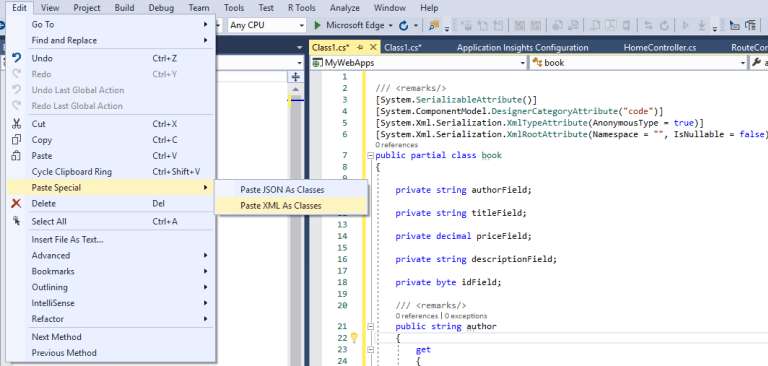

# 使用Visual Studio 自动创建JSON和XML类

在开发过程中，通常我们需要从JSON对象或XML对象生成类，尤其是在需要数据到对象的映射时。
通常，您可能会参考JSON或基于XML属性的属性名手动编写类的成员。
但是，在Visual Studio中有一个非常有趣但却很少被忽视的特性，使用它可以直接通过粘贴JSON或XML来生成类。

让我们快速地看一个例子。假设您有JSON。

```Json
{
"id": 1,
"name": "Product1",
"price": 12.50,
"tags": ["tag1", "tag2"]
}
```

现在，您需要为这个JSON提供一个类。可以执行以下步骤取代手动创建JSON对应的类:

* 在Visual Studio中创建一个空类
* 从主菜单Edit-Past Special-Paste JSON As Classes



有了这个，您就会发现您已经从所选的JSON中创建了一个已转换的类，如上图所示。
类似地，XML对象的情况也是一样的。您可以使用粘贴XML作为类来从XML文件生成类。

考虑下面的示例XML文件

```XML
<book id="1">
    <author>Book Author</author>
    <title>Book Title</title>
    <price>49.95</price>
    <description>Book description</description>
</book>
```

现在，您可以通过选择“Paste XML As Classes”来生成完整的类



这不是Visual Studio的一个新特性，它已经存在很久了。

有了这个特性，您可以使类更简单、更快、更有趣。不是吗!

希望这可以帮助!