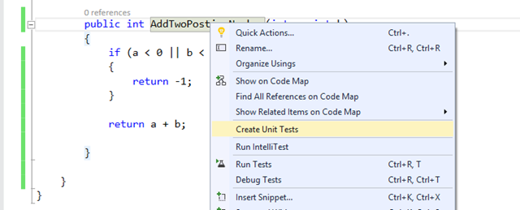
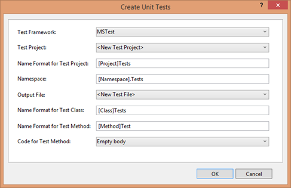
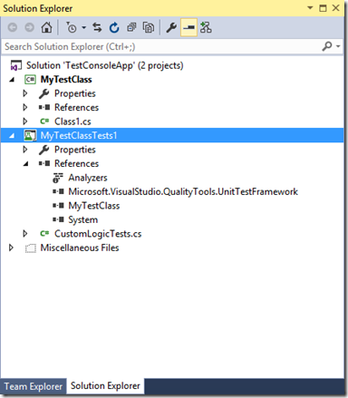
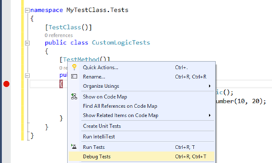
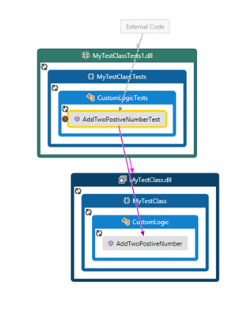
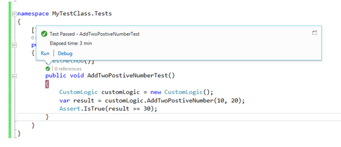
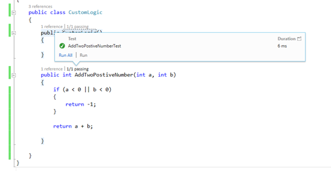

# 在Visual Studio中使用MSTest Framework创建单元测试

*作者：Abhijit Jana*

在Visual Studio中使用微软的单元测试框架编写单元测试不仅非常容易，而且它还提供了额外的优势。Visual Studio 提供了一系列编写，执行及验证你的代码的工具和功能。同时也有许多我们在编写单元测试时要考虑的东西，比如：mocking,代码覆盖等。本文简单介绍如果快速的创建一个单元测试。

假设有一个如下所示的求两个参数和的方法。如果有一个参数小于0，返回-1。

```CSharp
public int AddTwoPostiveNumber(int a, int b)
{
    if (a < 0 || b < 0)
    {
        return -1;
    }
    return a + b;
}
```
有多种方式来创建一个单元测试。第一种。在当前解决方案中添加一个新项-单元测试，在单元测试项目中添加该项目的引用。这样你就可以编写你的单元测试代码了。还有一种更简便的方法。在要被测试的方法上右键选择创建单元测试。

 

这时会弹出一个单元测试的对话框。测试框架选择MSTest，其他的不变，使用默认值。要确保 Code for Test Methods为Empty body.

 

选择确定。这时会在当前项目的解决方案中添加如下图所示的单元测试项目。新增的单元测试项目已经包含了对测试类库的引用，或者第三方的引用。

 

如下所示从模板中创建的单元测试的空方法

```CSharp
namespace MyTestClass.Tests
{
    [TestClass()]
    public class CustomLogicTests
    {
        [TestMethod()]
        public void AddTwoPostiveNumberTest()
        {
        
        }
    }
}
```

在AddTwoPostiveNumberTest方法中添加如下所示代码.使用Assert来验证结果。

```CSharp
[TestMethod()]
public void AddTwoPostiveNumberTest()
{
    CustomLogic customLogic = new CustomLogic();
    var result = customLogic.AddTwoPostiveNumber(10, 20);
    Assert.IsTrue(result == 30);
}
```
在测试方法中我们传入了10和20两个参数，结果应该是30.使用Assert来验证结果，最后应该是true。

在测试方法中右键选择调试测试或者执行测试来运行测试方法。

 

为了可视化和检查调试过程中的执行顺序，可以在Visual Studio中启用代码映射。这将向您展示如何从测试方法调用实际的方法，并返回测试方法的结果。

 


现在，您可以使用CodeLens来验证实际方法的状态以及测试方法的状态，如下图所示。
 


希望这篇文章能帮助到你。
