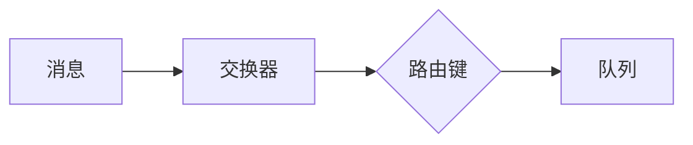

## RabbitMQ 知识点

消息队列应该是由谁来创建：
* 如果消息必须要保证不能丢失，那么生成者和消费者都应该来创建队列
* 通常情况下可以由消费者来创建队列

### 队列
* 为消息提供了处所，消息在此等待消费
* 队列是Rabbit中消息的最后的重点

### 交换器和绑定

交换器将消息根据规则(路由键)交给队列

* AMQP架构中最关键的几个组件：交换器，队列，绑定
* 根据绑定规则将队列绑定到交换器上
* 消息是发布到交换器上的
* 有三种类型的交换器：direct，fanout，topic
* 基于消息的路由键和交换器类型，服务器会决定将消息投递到哪个队列中