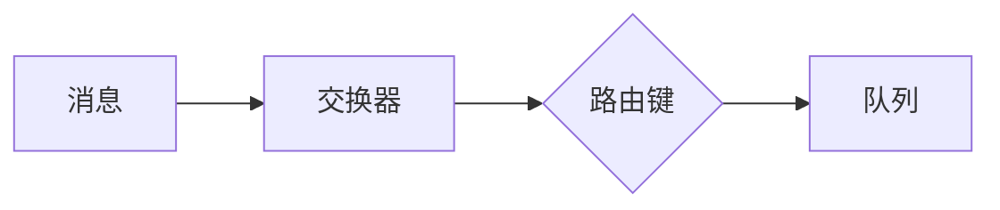

## RabbitMQ 知识点

消息队列应该是由谁来创建：
* 如果消息必须要保证不能丢失，那么生成者和消费者都应该来创建队列
* 通常情况下可以由消费者来创建队列

### 队列
* 为消息提供了处所，消息在此等待消费
* 队列是Rabbit中消息的最后的重点

### 交换器和绑定

交换器将消息根据规则(路由键)交给队列

* AMQP架构中最关键的几个组件：交换器，队列，绑定
* 根据绑定规则将队列绑定到交换器上
* 消息是发布到交换器上的
* 有三种类型的交换器：direct，fanout，topic
* 基于消息的路由键和交换器类型，服务器会决定将消息投递到哪个队列中

默认当RabbitMQ重启后，所有的队列和交换器都会消失（设置durable属性使这些是否持久化）

如果要做到持久化需要设置如下三点：
1. 将其投递模式选项设置为2
2. 发送到持久化的交换器
3. 到持久化的队列
4. 4

### Connection和Channel

AMQP的连接是耗时且耗资源的。建议一个APP，只有一个Connection，多个Channel

AMQP具有多路复用特性--多个Channel只基于一个Connection。就是说一个进程只有一个Connection但是有多个线程，每个线程都有自己的Channel

Channel允许可以频繁的开关，但是建议Channel也保持长活

**Channel不可以跨线程使用**

不建议将发送和接收的Connection使用同一个。当发送者需要发送大量数据时，会占用TCP通道，这个时候接收者就不能获取消息，必须等到发送者发送完毕，TCP通道被释放。

[RabbitMQ在DotNetCore中的封装使用](https://stackoverflow.com/questions/40611683/accessing-asp-net-core-di-container-from-static-factory-class)

### RabbitMQ中Connection是线程安全的，但是Channel不是

通常要保证一个app有一个长活的Connection

### Rabbitmq Demo实现

[Consumer-Demo](https://www.c-sharpcorner.com/article/consuming-rabbitmq-messages-in-asp-net-core/)
主要是使用BackgroundService，后台来接收消息

[Publish-Demo](https://www.c-sharpcorner.com/article/publishing-rabbitmq-message-in-asp-net-core/)
主要是使用了DefaultObjectPool<T>来定义了一个Chanel的对象管理池来publish message 

